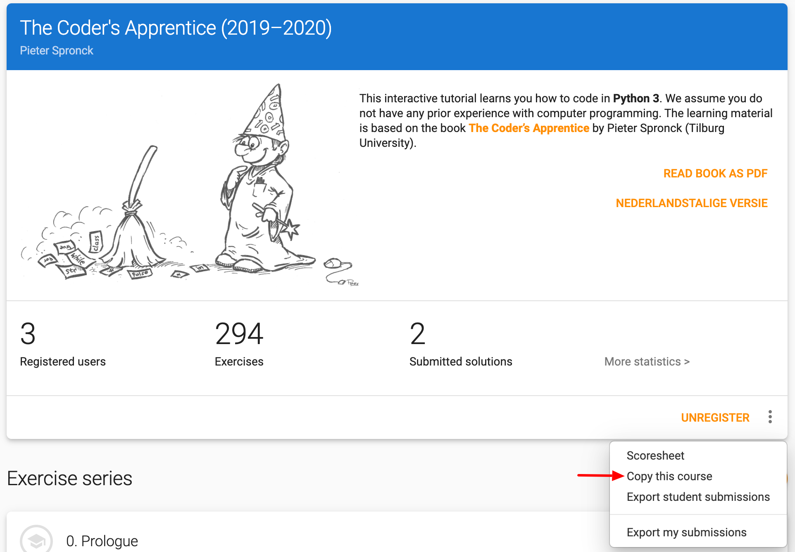

# FAQ: Featured courses

[[toc]]

## What is a featured course?

A 'Featured Course' on Dodona is a course that has been highlighted or recommended due to its educational content, quality or relevance to a particular topic or skill. Featured courses are curated and marked as such by Team Dodona.

The goal of featured courses is to help users navigate the wide range of courses available and identify those that may be particularly useful or well regarded. These courses are not created by Team Dodona.

## I made a course, how can I get it featured?

If you've created a course and would like to have it featured on Dodona, please contact Team Dodona through the [contact form](https://dodona.ugent.be/en/contact) or by sending an email to [dodona@ugent.be](mailto:dodona@ugent.be).

## How can I use a featured course?

As a student, you can use a featured course in the same way as any other course on Dodona. You can register for the course using the button at the top of the page and work through the material at your own pace. You can also submit solutions to the programming exercises and get instant feedback on your work.

As a teacher, we recommend that you make a copy of the featured course and use it as a starting point for your own course. This way, you can adjust the learning path of the course, set deadlines, monitor the progress of students, organize tests and exams, review submitted solutions, and appoint colleagues as fellow course administrators.

::: tip
Can't see the 'Copy this course' button? You probably don't have the rights to copy a course. Fill out the [rights request form](https://dodona.ugent.be/en/rights_requests/new/) to request the necessary rights and we'll get back to you as soon as possible.
:::

## Which featured courses are available?

An up-to-date list of featured courses can be found on the [featured courses page](https://dodona.ugent.be/en/courses/?tab=featured) of Dodona. At the moment, we only have featured courses for R and Python.

### The Coder's Apprentice

**The Coder's Apprentice** by Pieter Spronck (Tilburg University) is a free, [online textbook](http://www.spronck.net/pythonbook/index.xhtml) for learning introductory programming with Python 3. It is suitable for a first course in programming for computer scientists, engineers, and students in other disciplines.

Dodona offers an interactive version of this book, available in both [Dutch](https://dodona.ugent.be/nl/courses/293/) and [English](https://dodona.ugent.be/en/courses/296/).

<iframe width="560" height="315" src="https://www.youtube.com/embed/eAp-ftrZQDE" allow="accelerometer; autoplay; encrypted-media; gyroscope; picture-in-picture" allowfullscreen></iframe>

---

### R Basics

**R Basics** is an interactive course where you will build a foundation in R and learn the basics to wrangle data. The course is based on the first part of the e-book [Introduction to Data Science](https://rafalab.github.io/dsbook/) authored by Prof. Rafael Irizarry, Department of Data Sciences at the Dana-Farber Cancer Institute and Department of Biostatistics Harvard School of Public Health.

The course is only available in [English](https://dodona.ugent.be/en/courses/335/).

---

### R Data Exploration and Visualisation

**R Data Exploration and Visualisation** is an interactive course where you will learn basic data visualisation principles and how to apply them using ggplot2. The course is based on the second part of the e-book [Introduction to Data Science](https://rafalab.github.io/dsbook/) authored by Prof. Rafael Irizarry, Department of Data Sciences at the Dana-Farber Cancer Institute and Department of Biostatistics Harvard School of Public Health.

The course is only available in [English](https://dodona.ugent.be/en/courses/345/).

---

### Python-oefeningen bij Youtube videoreeks UHasselt

**Python-oefeningen bij Youtube videoreeks UHasselt** is an introductory Python course that combines a series of [YouTube videos](https://www.youtube.com/playlist?list=PL2iW_rkiCt7UqxL47lGkBaTgApj_QHJ0K) with exercises on Dodona. The course was created by Dirk Peeters.

The course is only available in [Dutch](https://dodona.ugent.be/nl/courses/290/).
