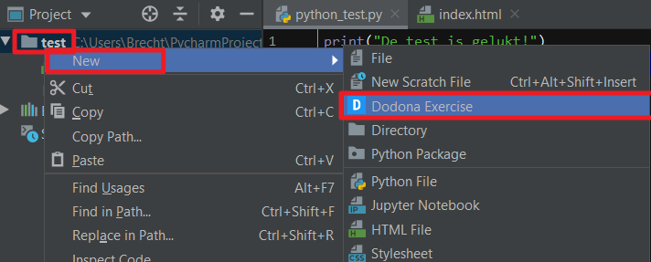
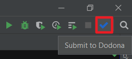
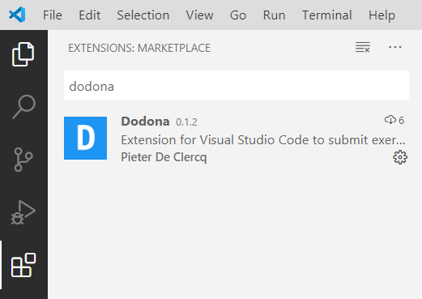

# FAQ: IDE plugins

[[toc]]

## What is an IDE plugin?

An IDE plugin for Dodona is a tool that integrates Dodona's features into your preferred IDE. While Dodona's platform allows you to write code directly in the online editor, most professional programmers prefer to use an IDE (or Integrated Development Environment) for coding. IDEs provide a robust set of tools for writing, debugging and executing code that can significantly improve productivity and code quality.

The Dodona IDE plugins allow you to seamlessly transfer your code from your IDE to Dodona. This means you can write and test your code in an environment you're comfortable with and then submit it directly to Dodona for evaluation and feedback. Currently, Dodona supports plugins for popular [JetBrains IDEs like PyCharm](#how-do-i-install-the-pycharm-plugin) and also for [Visual Studio Code](#how-do-i-install-the-vs-code-extension).

By using these plugins, you can enjoy the best of both worlds: the advanced features of your favourite IDE and the learning and evaluation tools of Dodona.

## How do I install the PyCharm plugin?

::: tip
These instructions also apply to other JetBrains IDEs like IntelliJ IDEA, WebStorm, PhpStorm, ...
:::

Follow the steps below to install the Dodona plugin for PyCharm:

1. **Create an API token**: Before installing the plugin, you need to create an API token on the Dodona website. This token allows PyCharm to submit solutions on your behalf without needing your password. You can create an API token by following the steps described in our [API token creation guide](/en/faq/api-tokens/#how-do-i-create-an-api-token). Keep the created token handy as you will need it the first time you use the plugin (see next question).

2. **Install the plugin**: The Dodona plugin can be installed directly from within PyCharm. Open the 'File' menu and click on 'Settings...'.
  
 In the 'Plugins' menu, select the 'Marketplace' tab and search for Dodona. Finally click on 'Install' and 'Restart'.
  
  Alternatively, you can install the plugin directly from the JetBrains website. Just go to https://plugins.jetbrains.com/plugin/11166-dodona and click on the blue `Get` button.

## How can I use the PyCharm plugin?

After successfully installing the Dodona plugin for PyCharm, you can follow these steps to use it:

1. **Start a new exercise**: First, PyCharm needs to know the specific exercise you're working on. To do this, right-click on an existing project or folder in PyCharm. In the 'New' menu, select 'Dodona Exercise'.
  
  When you create your first exercise, PyCharm will ask for your API token. Enter the API token you created earlier. You will then see a list of your Dodona courses. Select the appropriate course, series and exercise. PyCharm will automatically create a new file where you can write your solution. The first line of this new file will contain the link to the selected exercise as a comment.
  
  This line is crucial as PyCharm will use it to submit your solution to the correct exercise, so remember not to remove it.

2. **Submit your solution**: After solving the exercise, you can submit your solution directly from PyCharm. Look for a blue check mark in the top right corner of the interface.
  
  Clicking this button will submit your code to Dodona and trigger an automatic check. Shortly after submission, you should see a popup in the bottom right corner showing the result of your submission.
  
  If you want to see more details about the result, click on the 'more details' link to open the result in a new browser version. If you would like to resubmit, simply click on the blue check mark again. Remember, you can submit your solution as many times as you like.


## How do I install the VS Code extension?

Here's how to install the Dodona extension for Visual Studio Code:

1. **Create an API token**: Before you can install the extension, you need to create an API token on the Dodona website. This token will allow VS Code to submit solutions on your behalf without needing your password. If you need guidance on how to create an API token, please read [this FAQ article](/en/faq/api-tokens/). Be sure to keep the token you create handy as you'll need it soon.

2. **Install the extension**: You can install the Dodona extension directly from within VS Code. Open the 'Extensions' menu, search for 'Dodona' and click on the search result. Finally, click on 'Install'.
  
  Alternatively, you can install the extension directly from the VS Code Marketplace. Just go to the [Dodona plugin page](https://marketplace.visualstudio.com/items?itemName=thepieterdc.dodona-plugin-vscode) and click the green `Install` button.

3. **Insert API token**: After installing the extension, you need to insert the API token you created earlier. To do this, click on the gear icon in the bottom left corner of VS Code and select 'Settings' (or use the shortcut `Ctrl+,`). Then click on 'Extensions' and select 'Dodona'. Paste the API token you have created into the text box.
  

## How can I use the VS Code extension?

To use the Dodona VS Code extension, follow these steps:

1. **Start a new exercise:** In order for VS Code to know which exercise to submit your solution to, you need to add the Dodona URL of the exercise to the first line of your solution file. Make sure you mark this URL as a comment. For example, in JavaScript it would look like this

    ```javascript
    // https://dodona.be/nl/activities/1545120484/

    function echo(i) {
        return i;
    }
    ```
   Do not remove this line as VS Code uses it to send you to the correct exercise. If you press `ctrl` (or `cmd` on a Mac) while clicking on the URL, the exercise description will open in a new browser window.

2. **Submit your solution:** Once you've solved the exercise, you can easily submit your solution by using the 'Submit to Dodona' command. You can do this by opening the command palette with `Ctrl-Shift-P`, typing (part of) `Submit to Dodona` and pressing `Enter`. You can also create a shortcut for this command. This command will submit your code to Dodona and trigger an automatic test.
  

3. **Check the result:** After a few seconds, a popup should appear in the bottom right corner showing the result of your submission. Clicking the 'View results' button will open the result in a new browser window. You can submit your solution as many times as you like by repeating the same command.
  
