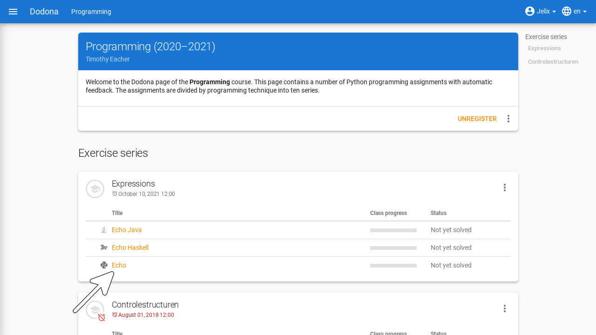
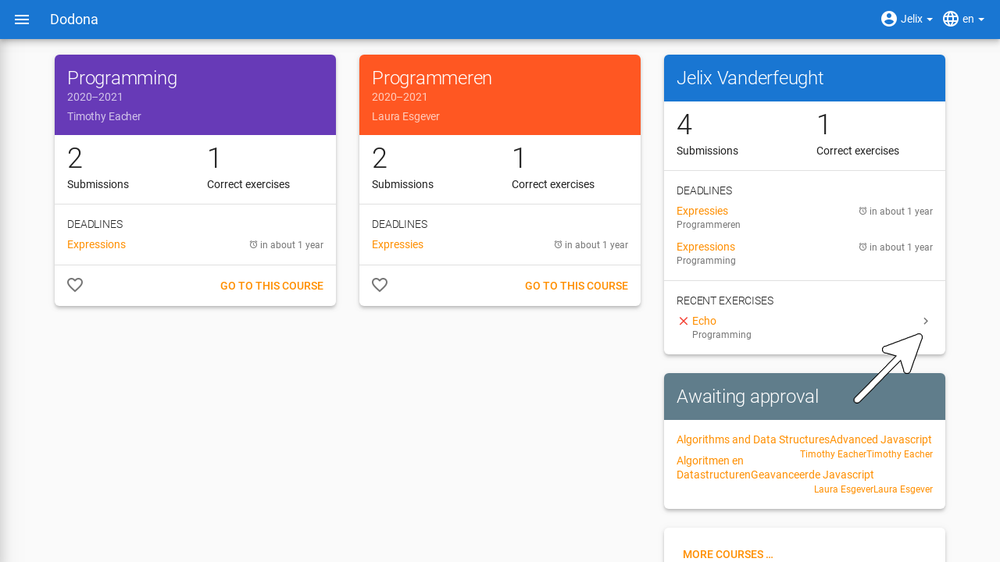
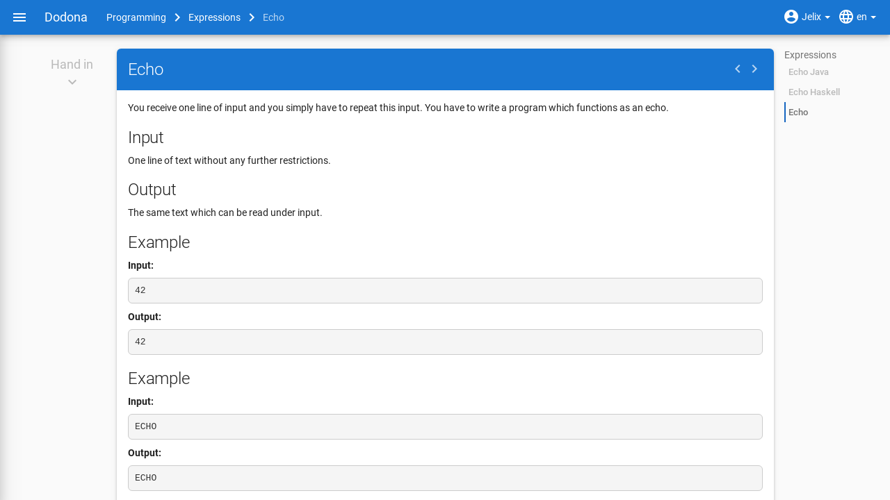
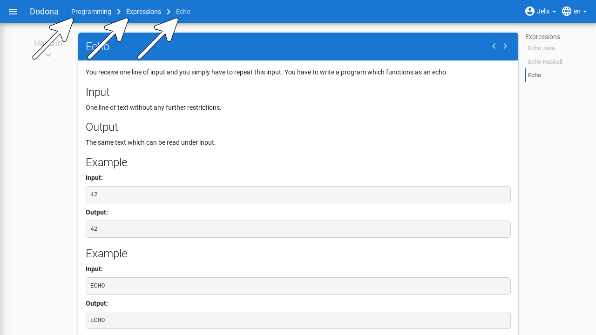
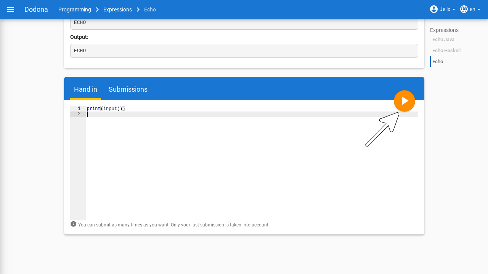
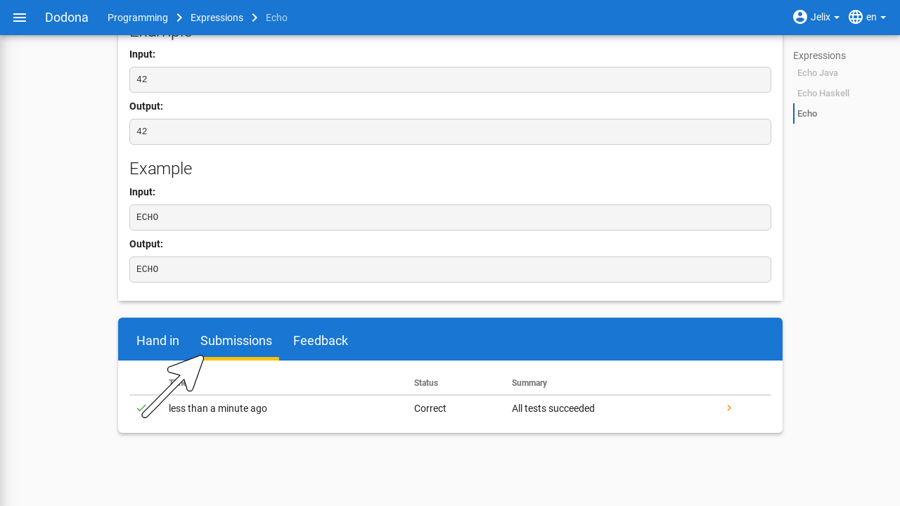
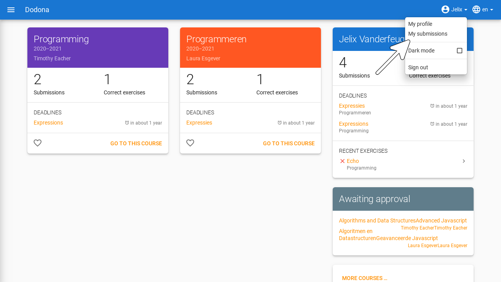
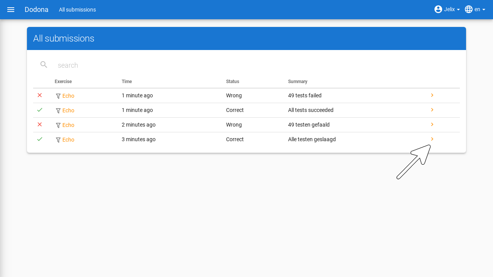
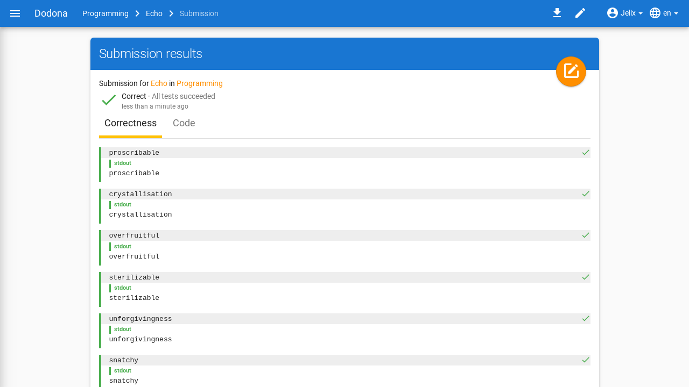
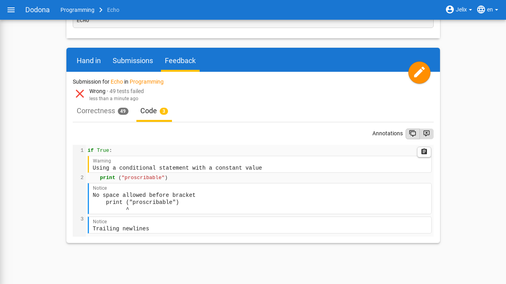

::: warning Sorry
For now, this page is only available in Dutch. Sorry!
:::

# Oefeningen oplossen
> Alle informatie zodat je als student kan navigeren naar oefeningen of oplossingen, oplossingen kan indienen en feedback kan interpreteren.

**Inhoudsopgave**
[[toc]]

## Navigeren naar een oefening

Op dodona kan je naar twee soorten oefeningen navigeren:
- Oefeningen dat tot een cursus behoren, kan je vinden door de pagina van een cursus te bezoeken.
    
- Oefeningen dat niet tot een cursus behoren, kan je vinden door het [activities overzicht](https://dodona.ugent.be/nl/activities/) te bezoeken dat een lijst bevat van alle oefeningen.

::: tip
Op je startpagina kan je een lijst vinden van de vijf laatste oefeningen waar je het laatst oplossingen voor ingediend hebt over alle cursussen heen. Zo kan je op een snelle manier een oefening waar je recent op hebt gewerkt selecteren door op de naam van de oefening te klikken.

:::

Na selectie van een oefening navigeer je naar de **oefeningpagina**. Bovenaan staat een paneel met de naam en de beschrijving van de oefening. De weergave van deze componenten is afhankelijk van de geselecteerde [taal](../login-and-settings/../login-and-settings/#selecteren-van-de-taal). Als bij het opstellen van de oefening een vertaling voorzien werd van de naam en de beschrijving in de geselecteerde taal, dan zullen deze componenten van de oefening ook in die taal weergegeven worden.

::: tip

Als je een actie aan het uitvoeren bent op een oefening dan verschijnt de naam van de oefening naast `Dodona` aan de linkerkant van de navigatiebalk, eventueel voorafgegaan door de naam van de [cursus](../courses/) en de naam van de oefeningenreeks waaruit je de oefening geselecteerd hebt. Door in de navigatiebalk op de naam van de oefening te klikken, navigeer je naar de oefeningpagina. Door in de navigatiebalk op de naam van de oefeningenreeks te klikken, navigeer je naar de oefeningenreeks op de cursuspagina. Door in de navigatiebalk op de naam van de cursus te klikken, navigeer je naar de cursuspagina.

:::

## Indienen van een oplossing

Op een oefeningpagina staat onder het paneel met de beschrijving van de [oefening](#navigeren-naar-een-oefening) een tweede paneel waarmee je een [oplossing](#navigeren-naar-een-oplossing) kunt indienen voor de oefening. Klik hiervoor op de tab `Indienen`, als deze tab niet geselecteerd was, en plaats de broncode van je oplossing in de **code editor**. Klik daarna op de indienknop in de rechterbovenhoek van het paneel om je oplossing in te dienen. Je mag zoveel indienen als je wil, enkel het resultaat van jouw laatste oplossing wordt in rekening gebracht. Bij elke oplossing wordt [feedback](#interpreteren-van-feedback) door de [judge](#interpreteren-van-feedback) gegeven die je kan gebruiken om je oplossing te corrigeren of verder te verfijnen.

::: tip

Om een aantal belangrijke redenen **raden we ten stelligste af om rechtstreeks broncode te schrijven in de code editor van Dodona**. In plaats daarvan adviseren we om een [Integrated Development Environment](https://nl.wikipedia.org/wiki/Integrated_development_environment) (IDE) te gebruiken voor het schrijven, uitvoeren, testen en debuggen van broncode. Voer je broncode eerst uit op een aantal testgevallen om na te gaan dat ze geen grammaticale en logische fouten meer bevat. Gebruik daarvoor bijvoorbeeld de testgevallen die in de beschrijving van de oefening gegeven werden. Als je ze wilt uittesten op een groter aantal testgevallen dien ze dan in op Dodona. Om logische fouten op te sporen kan je de debugger van je IDE gebruiken. Op die manier leer je je programmeervaardigheden generiek in te zetten om andere programmeeropdrachten aan te pakken dan enkel de oefeningen uit Dodona.
:::

Na het indienen van een [oplossing](#navigeren-naar-een-oplossing) wordt automatisch de tab `Oplossingen` geselecteerd. Deze tab bevat een overzicht van alle oplossingen die je in de [cursus](../courses/) hebt ingediend voor de oefening. Deze oplossingen worden in het overzicht opgelijst in omgekeerde chronologische volgorde (meest recente bovenaan), waardoor de oplossing die je net hebt ingediend helemaal bovenaan staat. Het overzicht bevat voor elke oplossing het tijdstip van indienen, de status en een korte samenvatting van de [feedback](#interpreteren-van-feedback). In het overzicht zie je vóór elke oplossing ook een [icoontje](../courses/#indienstatus) dat correspondeert met de status van de oplossing.

Om overbelasting van het platform tegen te gaan, worden [oplossingen](#navigeren-naar-een-oplossing) niet onmiddellijk beoordeeld na het indienen maar worden ze eerst in een **wachtrij** geplaatst. Zolang een oplossing in de wachtrij staat heeft ze de status `In de wachtrij...`. Van zodra het platform klaar is om een oplossing te beoordelen, wordt de eerst ingediende oplossing uit de wachtrij (*first-in-first-out*) geselecteerd en beoordeeld door een [judge](#interpreteren-van-feedback). Tijdens het beoordelen heeft een oplossing de status `Aan het uitvoeren...`.

Zodra de judge klaar is met het beoordelen van je oplossing krijgt ze haar finale status en wordt de [feedbackpagina](#feedbackpagina) met gedetailleerde [feedback](#interpreteren-van-feedback) over de oplossing automatisch weergegeven in een nieuwe tab `Feedback`.

## Navigeren naar een oplossing

Je kan op Dodona naar je ingediende oplossingen op verschillende manieren navigeren. Voor elke manier zullen de oplossingen door Dodona op een andere manier gegroepeerd worden. Hieronder volgen de drie belangrijkste manieren:

- Je kan al jouw oplossingen van één oefening bekijken door op de `Oplossingen` tab op de relevante oefeningenpagina te klikken.

- Je kan al jouw oplossingen zien door in het gebruikersmenu in de navigatiebalk op `Mijn oplossingen` te klikken.

- Je kan al jouw oplossingen binnen een cursus bekijken door op de `Ingediende oplossingen` van de relevante cursus kaart te klikken.

Een oplossingenoverzicht bevat voor elke oplossing het tijdstip van [indienen](#indienen-van-een-oplossing), de status en een korte [samenvatting](#samenvatting) van de [feedback](#interpreteren-van-feedback). Vóór elke oplossing staat ook nog een [icoontje](../courses/#indienstatus) dat correspondeert met de status van de oplossing. In het overzicht worden je oplossingen altijd opgelijst in omgekeerde chronologische volgorde (meest recente bovenaan).

<h1 id="feedbackpagina"/>

Je kunt een oplossing selecteren door in een oplossingenoverzicht op het groter dan symbool te klikken aan rechterkant van de oplossing. Hierdoor navigeer je naar de **feedbackpagina** met de gedetailleerde [feedback](#interpreteren-van-feedback) over de oplossing.

## Interpreteren van feedback

Op de feedbackpagina staat gedetailleerde **feedback** over een [oplossing](#navigeren-naar-een-oplossing) die je [ingediend](#indienen-van-een-oplossing) hebt voor een [oefening](#navigeren-naar-een-oefening). Zo snel mogelijk na het indienen wordt de oplossing automatisch beoordeeld door een **judge** die aan de oefening gekoppeld is. Als motivatie van zijn beoordeling voorziet de judge gedetailleerde feedback over de oplossing.

Aan de bovenkant van de feedbackpagina staan de volgende gegevens over de [oplossing](#navigeren-naar-een-oplossing):

- `Opgave`: De naam van de oefening waarvoor de oplossing werd [ingediend](#indienen-van-een-oplossing). Klik op de naam om naar de oefeningpagina te navigeren.

- `Cursus`: De naam van de [cursus](../courses/) waarbinnen de oplossing werd [ingediend](#indienen-van-een-oplossing). Klik op de naam om naar de cursuspagina te navigeren. Dit informatieveld ontbreekt als de oplossing niet binnen de context van een cursus werd ingediend.

- `Ingediend`: Het **tijdstip** waarop de oplossing werd [ingediend](#indienen-van-een-oplossing). Dit tijdstip wordt op een gebruiksvriendelijke manier weergegeven, bijvoorbeeld `ongeveer 2 uur geleden`. Als je de muiswijzer boven het tijdstip plaatst dan krijg je de gedetailleerde weergave van het tijdstip te zien.

- `Status`: De **status** die Dodona of de judge aan de oplossing heeft toegekend. Met elke status correspondeert een **icoontje** dat in elke oplijsting van de oplossing wordt weergegeven. Statussen met zwarte of gele icoontjes worden door Dodona toegekend. Statussen met groene of rode icoontjes worden door de judge toegekend. Betekenis van de mogelijke statussen die aan de oplossing kunnen toegekend worden:

| status               | icoontje             | betekenis            |
|----------------------|----------------------|----------------------|
| `In de wachtrij…` |  | oplossing staat in  de wachtrij |
| `Aan het uitvoeren...` |  | oplossing wordt momenteel beoordeeld door de judge |
| `Correct` |  | oplossing wordt momenteel beoordeeld door de judge |
| `Fout` |  | logische fout opgeworpen tijdens het uitvoeren van minstens één test |
| `Uitvoeringsfout` |  | onverwachte fout opgeworpen tijdens het uitvoeren van minstens één test |
| `Timeout` |  | tijdslimiet vastgelegd voor de oefening werd overschreden tijdens het testen; kan wijzen op slechte performantie of een oneindige lus. |
| `Geheugenfout` |  | geheugenlimiet vastgelegd voor de oefening werd overschreden tijdens het uitvoeren van minstens één test |
| `Compilatiefout` |  | oplossing bevat grammaticale fouten |
| `Interne fout` |  | judge is gecrashed tijdens het beoordelen van de oplossing; oorzaak van fout ligt dus niet bij de oplossing maar bij het falen van de judge |

Hoe lager de status in bovenstaande tabel wordt opgelijst, hoe zwaarder het soort fout dat ermee correspondeert. Als de judge bij het beoordelen van de [oplossing](#navigeren-naar-een-oplossing) verschillende soorten fouten tegenkomt, dan staat het hem vrij te beslissen welke status hij aan de oplossing toekent. Raadpleeg de documentatie van de judge voor meer details over de specifieke procedure die hij gebruikt om de status van de oplossing te bepalen.

<h1 id="samenvatting"/>
`Samenvatting`

Korte motivering van de judge bij de status die hij aan de oplossing heeft toegekend.

Daaronder staat meer gedetailleerde feedback die de judge kan uitgesplitst hebben over meerdere **tabs**. Naast de naam van een tab kan aan de rechterkant een **badge** staan met daarin een getal. Het getal geeft aan hoeveel fouten de judge gevonden heeft bij het uitvoeren van de testen waarover hij rapporteert onder de tab. Het staat de judge vrij om te beslissen of en op welke manier deze fouten geteld worden. Raadpleeg de documentatie van de judge voor meer details over de specifieke procedure die hij gebruikt om de waarde voor de badge te bepalen.

De laatste tab heeft altijd de naam `Code` en bevat de broncode van de [oplossing](#navigeren-naar-een-oplossing). Op bepaalde plaatsen in de broncode kan de judge opmerkingen toegevoegd hebben (bijvoorbeeld over de programmeerstijl) die ook kunnen motiveren waarom hij een bepaalde status aan de oplossing toegekend heeft.

::: tip

In de tab `Code` op de feedbackpagina kan je de broncode van de [oplossing](#navigeren-naar-een-oplossing) niet wijzigen. Als je op de broncode drukt dan wordt die volledig geselecteerd. Kopieer de broncode naar het klembord en plak die in je IDE. Als alternatief kan je op de downloadknop klikken in de rechterbovenhoek van de feedbackpagina. Daarmee download je een bestand met de broncode dat je dan kan openen in je IDE. In je IDE kan je de broncode bewerken en daarna eventueel opnieuw [indienen](#indienen-van-een-oplossing).

Als alternatief kan je ook op de bewerkknop klikken in de rechterbovenhoek van de feedbackpagina om te navigeren naar de [oefening](#navigeren-naar-een-oefening) waarvoor de [oplossing](#navigeren-naar-een-oplossing) werd ingediend. De broncode van de oplossing werd daarbij ingevoegd in de code editor aan de onderkant van de oefeningpagina. Daar kan je de broncode bewerken en daarna eventueel opnieuw indienen.
:::

Onder een tab rapporteert de judge over individuele **testen** waaraan hij de broncode onderworpen heeft. Daarbij worden gerelateerde testen gegroepeerd in een **testgeval** en worden testgevallen die van elkaar afhankelijk zijn gegroepeerd in een **context**.

Visueel worden alle testgevallen van een context met elkaar verbonden via een dunne vertikale lijn aan de linkerkant. De kleur van die lijn geeft aan of de judge de volledige context beoordeelt als geslaagd (groene lijn) of als niet geslaagd (rode lijn).

Aan de rechterkant van de dunne vertikale lijn worden de testgevallen van de context onder elkaar weergegeven. De beschrijving van een testgeval wordt weergegeven binnen een rechthoek met lichtgrijze achtergrondkleur die over de volledige breedte loopt. In de rechterbovenhoek van die rechthoek staat een gekleurd symbool dat aangeeft of de judge het volledige testgeval beoordeelt als geslaagd (groen vinkje) of als niet geslaagd (rood kruisje).

Als de judge binnen een testgeval rapporteert over individuele testen, dan worden die opgelijst onder de rechthoek met lichtgrijze achtergrond waarin de beschrijving van het testgeval staat. Om visueel onderscheid te maken met de weergave van het testgeval, wordt elke test weergegeven met een kleine marge links en rechts. De weergave van een test bestaat zelf uit de volgende optionele componenten die onder elkaar worden weergegeven:

-   Een beschrijving van de uitgevoerde test. Deze beschrijving wordt weergegeven binnen een rechthoek met dezelfde lichtgrijze achtergrondkleur als bij de beschrijving van een testgeval.

-   Een tekstuele vergelijking tussen een verwachte waarde en een waarde die gegenereerd werd aan de hand van de oplossing. Als minstens één van beide waarden uit meerdere regels bestaat, dan worden de overeenkomstige regels tegenover elkaar uitgelijnd. Identieke overeenkomstige regels worden weergegeven met een transparante achtergrondkleur. Als overeenkomstige regels van elkaar verschillen dan worden ze weergegeven met een lichtgekleurde achtergrondkleur (groen voor de verwachte waarde en rood voor de gegenereerde waarde). Individuele karakters die verschillen binnen overeenkomstige regels worden weergegeven met een donkerder achtergrondkleur (groen voor de verwachte waarde en rood voor de gegenereerde waarde).

- Algemene feedback over de uitgevoerde test. Voor deze feedback heeft de judge alle vrijheid wat betreft de vormgeving, waardoor hij zowel tekstuele als grafische feedback kan aanleveren.

De judge kan niet enkel algemene feedback geven over individuele testen, maar ook over individuele testgevallen, individuele contexten en de volledige [oplossing](#navigeren-naar-een-oplossing). De algemene feedback over de volledige oplossing staat aan de bovenkant van de feedbackpagina, tussen de gegevens van de oplossing en de tabs. De algemene feedback over een tab staat boven de weergave van de contexten onder de tab. De algemene feedback over een context staat onder de weergave van de testgevallen van de context. De algemene feedback over een testgeval staat onder de weergave van de testen van het testgeval.
