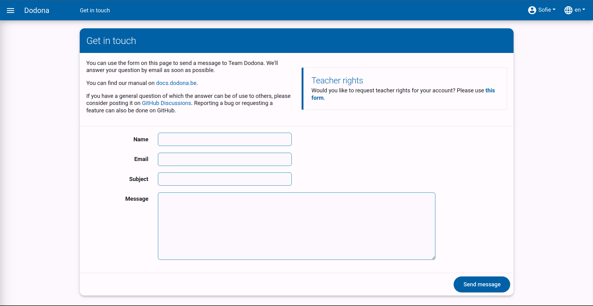

# Getting Started with Dodona as a Student
On this page, you will find all the information you need to get started with Dodona as a student.

## What is Dodona?

Dodona is an online practice platform for learning programming. The web application was developed at Ghent University to support practical sessions for large groups of students. Dodona focuses primarily on the automatic testing and feedback for submitted solutions to programming exercises. Currently, Dodona supports the programming languages Python, JavaScript, Java, Kotlin, C#, bash, Prolog, Haskell, and R.

## Structure of the Guide

The guide is divided into three parts.

* The first part, [Signing Up & User Settings](../login-and-settings/), explains how to create a user account on Dodona and how to personalize it.
* The second part, [Courses on Dodona](../courses/), discusses how to register to and unsubscribe from a course, how to navigate to a course, and how to interpret the submission status.
* The last part, [Solving Exercises](../exercises/), contains all the information related to navigating to exercises or submissions, submitting solutions, and interpreting feedback.

## Contact Us

If you have questions about how Dodona works or if you have interesting ideas on how we can improve or expand the platform, please feel free to contact us. All comments and suggestions are more than welcome. To do so, navigate to the [contact page](https://dodona.be/en/contact/) by clicking on `Contact` in the footer (at the bottom of every page).
Then fill in the details in the `Get in touch` panel and click the `send message` button in the bottom right corner of the panel.

