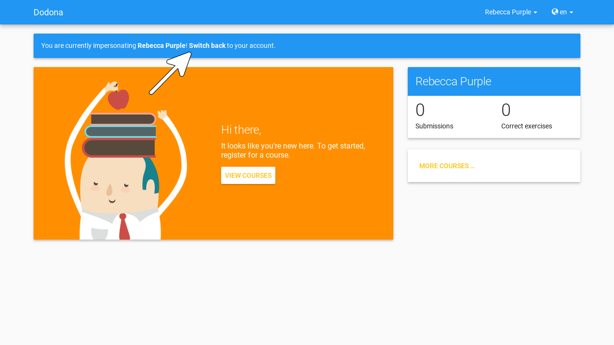

# User management

All **users** can [sign in](/en/for-students#sign-in) and manage their [user profile](/en/for-students#user-profile). Some actions on Dodona require more [permissions](#permissions). For this reason, we use three roles: [students](#student), [teachers](#teacher) and [admins](#admin). These roles can be [assigned](#assign-roles) to users, for instance a teacher can appoint another teacher.

::: tip

You can see that you are a [teacher](#teacher) when you can see the **management menu** (menu Admin) left of the [user menu](/en/for-students#user-menu) at the right side of the [navigation drawer](/en/for-students#navigation-drawer).

:::

::: tip Important

We divide the [enrolled](/en/for-students#course-register) members of a [course](/en/course-management#course) in [students](#student) and
[course managers](/en/course-management#course-manager) depending on the [management permissions](#management-permissions)they have been granted for the course. Only course managers can manage a course. The 
[managing](/en/course-management#managing-course-users) of 
[course users](/en/course-management#course-user) and [appointing](/en/course-management#appointing-course-managers) course managers is discussed in [course management](/en/course-management).
:::

## Navigating to a user

As a [teacher](#teacher), you navigate to the [user overviewt](#user-overview) by selecting Users in the [management menu](#management-menu) at the right side of the [navigation panel](/en/for-students#navigation-panel).

## User overview
In the **user overview**, the user's username, real name, email and [progress statistics](#user-progress-statistics) are listed from the [user profile](/en/for-students#user-profile) from all users. In the first column, you can find an [icon](#user-permissions-icon) that corresponds to the [management permissions](#management-permissions) that have been [assigned](#assign-permissions) to that user.

## Searching a user
Use the search bar at the top of the [user overview](#user-overview) to search for specific users based on their usernames, names or email addresses.

## Selecting a user
Click on the username to [navigate](#navigating-to-a-user) to the [profile page](/en/for-students#profile-page) of te user.

## User progress statistics voortgangsstatistieken
The **progress statistics** of a user consists of two numbers $c/s$, where $s$ is the number of [exercises](/en/for-students#exercise) for which that user has [submitted](/en/for-students#submitting-a-solution) atleast one [solution](/en/for-students#solution) and $c$ is the number of [exercises](/en/for-students#exercise) for which that user has [submitted](/en/for-students#submitting-a-solution) atleast one *correct* [solution](/en/for-students#solution).

## Editing a user profile
As a [teacher](#teacher), you can edit the [user profile](/en/for-students#user-profile) of [students](#student) and other teachers. To do this, click the edit button in the top right corner of the [profile page](/en/for-students#profile-page) of the user.

Alternatively, you can press the edit button at the right side of a user in the [user overview](#user-overview) to immediately edit their [user profile](/en/for-students#user-profile)

## Management permissions

In order to perform certain action on Dodona, you require additional **management permissions**. As a [teacher](#teacher), you can use the property Permissions on the [profile page](/en/for-students#profile-page) of a user to find out which permissions that user has.

## User permissions icon
Users can be assigned the following [management permissions](#management-permissions):

 | name                                          | icon                                |permissions|
 | ----------------------------------------------|-----------------------------------------|----------|
 | Student|   *no icon*|                                  [students](#student) can [edit](/en/for-students#user-profile-edit) their [user profile](/en/for-students#user-profile),[register](/en/for-students#course-register) for [courses](/en/course-management#course) and [submit](/en/for-students#submit-solution) [solutions](/en/for-students#solution) for [exercises](/en/for-students#exercise)|
 |Staff|     |   [teachers](#teacher) have all the permissions [students](#student) have and can additionally appoint teachers,, [edit](/en/for-students#user-profile-edit) the [profile](/en/for-students#user-profile) of students and teachers, [create](/en/course-management#create-a-course) [courses](/en/course-management#course) , [add](/en/course-management#add-exercise) [exercises](/en/for-students#exercise) and [add](/en/creating-a-judge) [judges](/en/for-students#judge) |
 |Zeus|      |    [admins](#admin) have all the permissions [teachers](#teacher) and course administrators have and can additionally assign all [management permissions](#management-permissions) (including course managers), [edit](/en/for-students#edit-user-profile) the [profile](/en/for-students#user-profile) of all users, [edit](/en/course-management#edit-course) all [courses](/en/course-management#course), [edit](/en/course-management#edit-exercise) all [exercises](/en/for-students#exercise) and [edit]((/en/judges#edit-judge)) all [judges](/en/for-students#judge).

### Student
A user with Student [management permissions](#management-permissions)permissions is called a **student**.
### Teacher
A user with Staff [management permissions](#management-permissions)permissions is called a **teacher**.
### Admin
A user with Zeus [management permissions](#management-permissions)permissions is called an **admin**.

## Assigning permissions
When you [edit](/en/for-students#user-profile-edit) the [profile](/en/for-students#gebruikersprofiel) of a user,
you can also assign [permissions](#management-permissions) to that user. A teacher can only assign the Student and
Staff permissions to other users (including themselves). In this fashion you can promote a user to a teacher or demote them to a [student](#student).
:::

::: tip Important

If you are a [teacher](#teacher) and you demote yourself to [student](#student), you cannot promote yourself back to teacher.
:::

## Impersonating users

As a [teacher](#teacher) you can temporarily take control of the[user account](/en/for-students#user-account) of a [student](#student). This allows you to see the personalised version of Dodona through the eyes of the student. This can be useful to answer questions about something a student encountered an issue in Dodona or when they want to perform actions on Dodona. Additionally, it allows you to perform actions in the name of the student, such as [registering](/en/for-students#course-register) for a [course](/en/course-management#course) or [submitting](/en/for-students#submit-solution) a [solution](/en/for-students#solution) for an [exercise](/en/for-students#exercise).

Press the button Impersonate account
on the [profile page](/en/for-students#profile-page) of
a student to temporarily [impersonate](#impersonating-users) a user.

Alternatively, you can impersonate students by pressing the [impersonate](#impersonating-users) action button
at the right side of a student in the [user overview](#user-overview).

::: tip Important

When you [register](/en/for-students#course-register)
for a [course](/en/course-management#course) or [submit](/en/for-students#submit-solution) a
[solution](/en/for-students#solution)
for an
[exercise](/en/for-students#exercise) while [impersonating](#impersonating-users) a [student](#students),
those actions will have the same effect as if they were performed by the student himself.
Make sure that you want to perform these actions in name of the student, otherwise you should [return](#stop-impersonating) to your own account to perform the actions as yourself.
:::

### Stop impersonating
While you are [impersonating](#impersonating-users) a user, a notification is displayed at the top of the page to remind you of this fact.
It contains a link that allows you to stop the impersonating process and thus return to your own [account](/en/for-students#user-account).
:::

