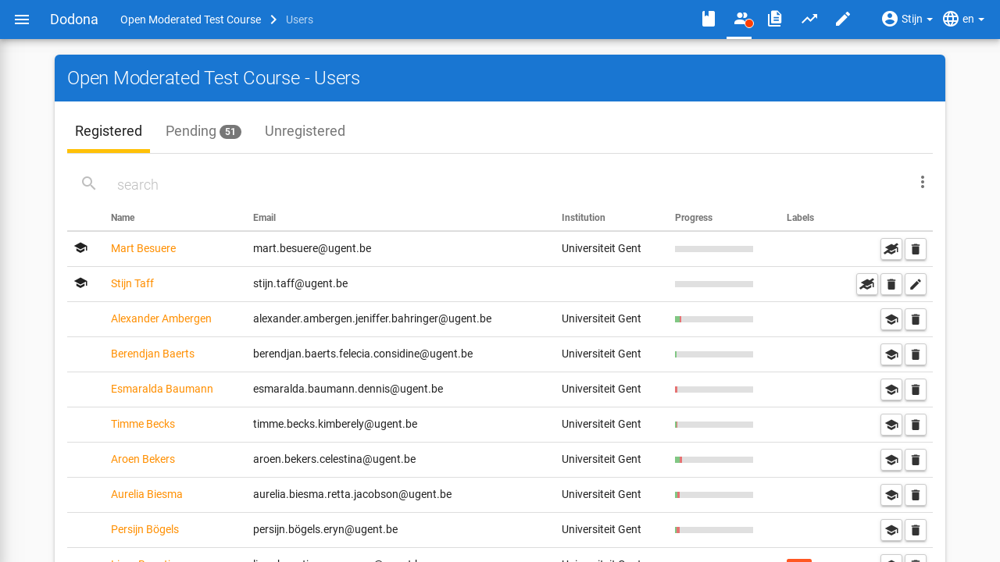
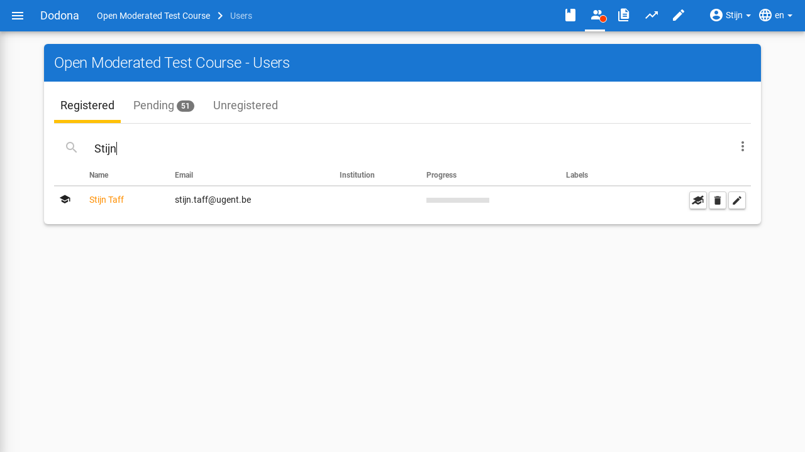

# User management

All **users** can [sign in](/en/for-students#sign-in) and manage their [user profile](/en/for-students#user-profile). Some actions on Dodona require more [permissions](#permissions). For this reason, we use three roles: [students](#student), [teachers](#teacher) and [admins](#admin). A course administrator is an exception, such a user has teacher permissions within a course only. These roles can be [assigned](#assign-roles) to users by admins and teachers.

::: tip

You can see that you are a [teacher](#teacher) when you can see the **management menu** (menu Admin) at the left side of the page when clicking on the hamburger menu.

:::

::: tip Important

We categorize [enrolled](/en/for-students#course-register) members of a [course](/en/course-management#course) in [students](#student) and
[course managers](/en/course-management#course-manager) depending on the [management permissions](#management-permissions) they have been granted for the course. Only course managers can manage a course.
[Managing](/en/course-management#managing-course-users)
[course users](/en/course-management#course-user) and [appointing](/en/course-management#appointing-course-managers) course managers is discussed in [course management](/en/course-management).
:::

## Navigating to a user

As a [teacher](#teacher), you navigate to the [user overview](#user-overview) of your course by navigating to your course and clicking Registered users in the course description panel.

## User overview
In the **user overview**, the user's username, real name, email and [progress statistics](#user-progress-statistics) are listed from the [user profile](/en/for-students#user-profile) from all users. In the first column, you can find an [icon](#user-permissions-icon) that corresponds to the [management permissions](#management-permissions) that have been [assigned](#assign-permissions) to that user.

## Searching a user
Use the search bar at the top of the [user overview](#user-overview) to search for specific users based on their usernames, names or email addresses.

## Selecting a user
Click on the name to [navigate](#navigating-to-a-user) to the [profile page](/en/for-students#profile-page) of the user.

## User progress statistics
The **progress statistics** of a user are displayed via a progress bar. The green section denotes the fraction of [exercises](/en/for-students#exercise) within the course for which this user has [submitted](/en/for-students#submit-solution) a *correct* [solution](/en/for-students#solution). The red part is the amount of exercises that the user started, but did not complete. The grey part depicts the remaining exercises in the course that the user did not start yet.

## Management permissions

In order to perform certain action on Dodona, you require additional **management permissions**. As a [teacher](#teacher), you can find this information in the [user overview](#user-overview) using the icons below. You can the use the icons on the right to modify the permissions of a user. A teacher can only assign the Student and Course admin permissions to other users (including themselves). In this fashion you can promote a user to a course admin or demote them to a [student](#student).

::: tip Important

If you are a [teacher](#teacher) and you demote yourself to [student](#student), you cannot promote yourself back to teacher.
:::

## User permissions icon
Users can be assigned the following [management permissions](#management-permissions):

 | name                                          | icon                                |permissions|
 | ----------------------------------------------|-----------------------------------------|----------|
 | Student|   *no icon*|                                  [students](#student) can [edit](/en/for-students#user-profile-edit) their [user profile](/en/for-students#user-profile),[register](/en/for-students#course-register) for [courses](/en/course-management#course) and [submit](/en/for-students#submit-solution) [solutions](/en/for-students#solution) for [exercises](/en/for-students#exercise)|
 |Staff|     |   [teachers](#teacher) have all the permissions [students](#student) have and can additionally appoint teachers, [create](/en/course-management#create-a-course) [courses](/en/course-management#course) , [add](/en/course-management#add-exercise) [exercises](/en/for-students#exercise) and [add](/en/creating-a-judge) [judges](/en/for-students#judge) |
  |Course admin| |[course admins](#course-admin) have the same permissions as teacher, but limited to the scope of the course they were appointed in. They cannot create judges or courses, but they can edit exercises or students within a course in the same way a teacher can.| 
 |Zeus|      *no icon*|    [admins](#admin) have all the permissions [teachers](#teacher) and course administrators have and can additionally assign all [management permissions](#management-permissions) (including course managers), [edit](/en/for-students#edit-user-profile) the [profile](/en/for-students#user-profile) of all users, [edit](/en/course-management#edit-course) all [courses](/en/course-management#course), [edit](/en/course-management#edit-exercise) all [exercises](/en/for-students#exercise) and [edit]((/en/judges#edit-judge)) all [judges](/en/for-students#judge).

### Student
A user with Student [management permissions](#management-permissions)permissions is called a **student**.
### Teacher
A user with Staff [management permissions](#management-permissions)permissions is called a **teacher**.
### Course admin
A user with the teacher role within a course is called a course admin.
### Admin
A user with Zeus [management permissions](#management-permissions)permissions is called an **admin**.
