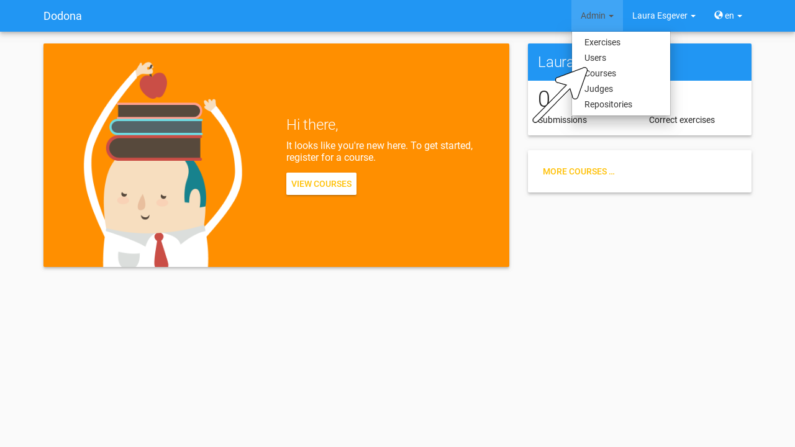
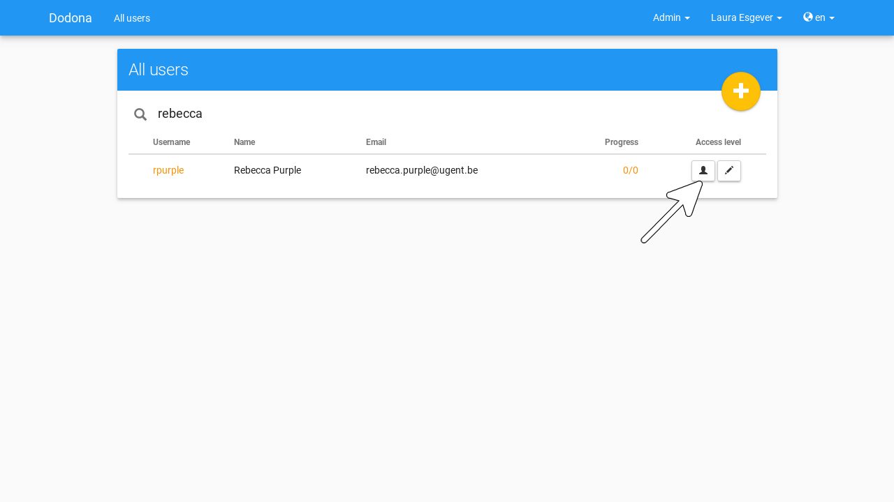

# User management

All **users** can [sign in](/en/for-students#sign-in) and manage their [user profile](/en/for-students#user-profile). Some actions on Dodona require more [permissions](#permissions). For this reason, we use three roles: [students](#students), [teachers](#teachers) and [admins](#admins). These roles can be [assigned](#assign-roles) to users, for instance a teacher can appoint another teacher.

::: tip

You can see that you are a [teacher](#teachers) when you can see the **management menu** (menu Admin) left of the [user menu](/en/for-students#user-menu) at the right side of the [navigation drawer](/en/for-students#navigation-drawer).

:::

::: tip Important

We divide the [enrolled](/en/for-students#course-register) members of a [course](/en/course-management#course) in [students](#students) and
[course managers](/en/course-management#course-manager) depending on the [management permissions](#management-permissions)they have been granted for the course. Only course managers can manage a course. The 
[managing](/en/course-management#managing-course-users) of 
[course users](/en/course-management#course-user) and [appointing](/en/course-management#appointing-course-managers) course managers is discussed in [course management](/en/course-management).
:::

## Navigating to a user

As a [teacher](#teachers), you navigate to the [user overviewt](#user-overview) by selecting Users in the [management menu](#management-menu) at the right side of the [navigation panel](/en/for-students#navigation-panel).

## User overview
In the **user overview**, the user's username, real name, email and [progress statistics](#user-progress-statistics) are listed from the [user profile](/en/for-students#user-profile) from all users. In the first column, you can find an [icon](#user-permissions-icon) that corresponds to the [management permissions](#management-permissions) that have been [assigned](#assign-permissions) to that user.

## Searching a user
Use the search bar at the top of the [user overview](#user-overview) to search for specific users based on their usernames, names or email addresses.

## Selecting a user
Click on the username to [navigate](#navigating-to-a-user) to the [profile page](/en/for-students#profile-page) of te user.

## User progress statistics voortgangsstatistieken
The **progress statistics** of a user consists of two numbers $c/s$, where $s$ is the number of [exercises](/en/for-students#exercise) for which that user has [submitted](/en/for-students#submitting-a-solution) atleast one [solution](/en/for-students#solution) and $c$ is the number of [exercises](/en/for-students#exercise) for which that user has [submitted](/en/for-students#submitting-a-solution) atleast one *correct* [solution](/en/for-students#solution).

## Editing a user profile
As a [teacher](#teachers), you can edit the [user profile](/en/for-students#user-profile) of [students](#students) and other teachers. To do this, click the edit button in the top right corner of the [profile page](/en/for-students#profile-page) of the user.

Alternatively, you can press the edit button at the right side of a user in the [user overview](#user-overview) to immediately edit their [user profile](/en/for-students#user-profile)

## Management permissions

In order to perform certain action on Dodona, you require additional **management permissions**. As a [teacher](#teachers), you can use the property Permissions on the [profile page](/en/for-students#profile-page) of a user to find out which permissions that user has.

## User permissions icon
Users can be assigned the following [management permissions](#management-permissions):

 | name                                          | icon                                |permissions|
 | ----------------------------------------------|-----------------------------------------|----------|
 | Student|   *no icon*|                                  [students](#students) can [edit](/en/for-students#user-profile-edit) their [user profile](/en/for-students#user-profile),[register](/en/for-students#course-register) for [courses](/en/course-management#course) and [submit](/en/for-students#submit-solution) [solutions](/en/for-students#solution) for [exercises](/en/for-students#exercise)|
 |Staff|     |   [teachers](#teachers) have all the permissions [students](#students) have and can additionally appoint teachers,, [edit](/en/for-students#user-profile-edit) the [profile](/en/for-students#user-profile) of students and teachers, [create](/en/course-management#create-a-course) [courses](/en/course-management#course) , [add](/en/course-management#add-exercise) [exercises](/en/for-students#exercise) and [add](/en/creating-a-judge) [judges](/en/for-students#judge) |
 |Zeus|      |    [admins](#admins) have all the permissions [teachers](#teachers) and course administrators have and can additionally assign all [management permissions](#management-permissions) (including course managers), [edit](/en/for-students#edit-user-profile) the [profile](/en/for-students#user-profile) of all users, [edit](/en/course-management#edit-course) all [courses](/en/course-management#course), [edit](/en/course-management#edit-exercise) all [exercises](/en/for-students#exercise) and [edit]((/en/judges#edit-judge)) all [judges](/en/for-students#judge).

### Students
A user with Student [management permissions](#management-permissions)permissions is called a **student**.
### Lesgevers
A user with Staff [management permissions](#management-permissions)permissions is called a **teacher**.
### Beheerders
A user with Zeus [management permissions](#management-permissions)permissions is called an **admin**.

## Assigning permissions
When you [edit](/en/for-students#user-profile-edit) the [profile](/en/for-students#gebruikersprofiel) of a user,
you can also assign [permissions](#management-permissions) to that user.
Als [lesgever](#lesgevers) kan je enkel de
beheersrechten Student en
Staff toekennen aan gebruikers
(inclusief jezelf). Op die manier kan je een gebruiker promoveren tot
lesgever of degraderen tot [student](#studenten).
:::

::: tip Belangrijk

Als je jezelf als [lesgever](#lesgevers)
degradeert tot [student](#studenten), dan
kan je jezelf daarna niet terug promoveren tot lesgever.
:::

## Gebruikersaccount overnemen

Als [lesgever](#lesgevers) kan je tijdelijk
de [gebruikersaccount](/en/for-students#gebruikersaccount)
van een [student](#studenten) overnemen.
Daardoor krijg je de gepersonaliseerde versie van Dodona te zien door de
ogen van de student. Dit kan interessant zijn voor het beantwoorden van
vragen over iets wat een student waarneemt in Dodona of over een actie
die ze in Dodona wil uitvoeren. Bovendien laat het je ook toe om zelf
acties uit te voeren in naam van de student, zoals het
[registreren](/en/for-students#cursus-registreren) voor
een [cursus](/en/course-management#cursus) of het
[indienen](/en/for-students#oplossing-indienen) van een
[oplossing](/en/for-students#oplossing) voor een
[oefening](/en/for-students#oefening).

::: tip Belangrijk

Als je [registreert](/en/for-students#cursus-registreren)
voor een [cursus](/en/course-management#cursus) of een
[oplossing](/en/for-students#oplossing)
[indient](/en/for-students#oplossing-indienen) voor een
[oefening](/en/for-students#oefening) terwijl je de
[gebruikersaccount](/en/for-students#gebruikersaccount)
van een [student](#studenten) aan het
[overnemen](#gebruikersaccount-overnemen)
bent, dan hebben deze acties hetzelfde effect alsof ze door de student
zelf zouden uitgevoerd worden. Wees je er dus van bewust of je deze
acties in naam van de student wilt uitvoeren of dat je eerst wilt
[terugkeren](#eigen-gebruikersaccount-herstellen) naar je eigen gebruikersaccount om daarna de acties onder
eigen naam uit te voeren.
:::

Druk op de knop Account overnemen
op de [profielpagina](/en/for-students#profielpagina) van
een student om zijn/haar
[gebruikersaccount](/en/for-students#gebruikersaccount)
tijdelijk
[over](#gebruikersaccount-overnemen).

Als alternatief kan je de
[gebruikersaccount](/en/for-students#gebruikersaccount)
van een student ook tijdelijk overnemen door in het
[gebruikersoverzicht](#gebruikersoverzicht) aan de rechterkant van een student te drukken op de
actieknop voor het
[overnemen](#gebruikersaccount-overnemen)
van gebruikersaccounts.

### Eigen gebruikersaccount herstellen
Terwijl je de [gebruikersaccount](/en/for-students#gebruikersaccount) van een [student](#studenten)
aan het [overnemen](#gebruikersaccount-overnemen) bent, wordt bovenaan elke pagina een mededeling getoond om
je daaraan te herinneren. De mededeling bevat een link waarmee je kunt
terugkeren naar je eigen gebruikersaccount.
:::

