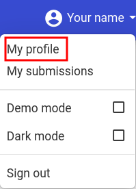
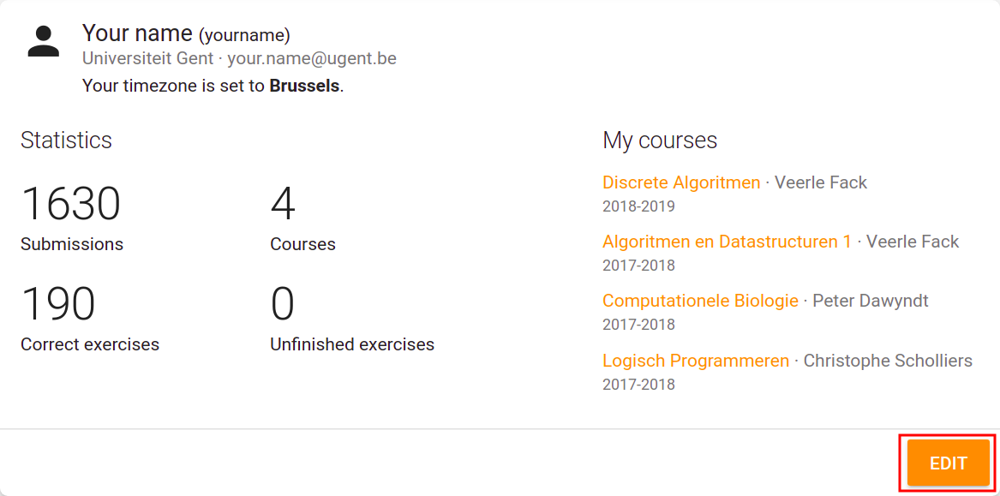

# Creating an API token

By creating an API token, you can authorize external applications, such as the [Dodona plugin for JetBrains IDEs](https://plugins.jetbrains.com/plugin/11166-dodona), to act on your behalf, without ever providing them with your password. To create an API token, simply follow these four steps:

## 1. Go to your profile page

First, go to your profile page by clicking the link in the dropdown menu.

## 2. Edit your profile

At your profile page, click the yellow `EDIT`-button at the bottom.

## 3. Create a token

Scroll to the bottom of the page and generate a new token by clicking the `+`-button. You can choose the description yourself.

## 4. Copy the token

Copy the newly generated token and paste it in the authentication dialog of the plugin. On Dodona, you can see a list of all your active tokens. Be aware that you can't see the tokens themselves out of security considerations. You can delete a token at any time. This will cause that token to stop functioning immediately.

