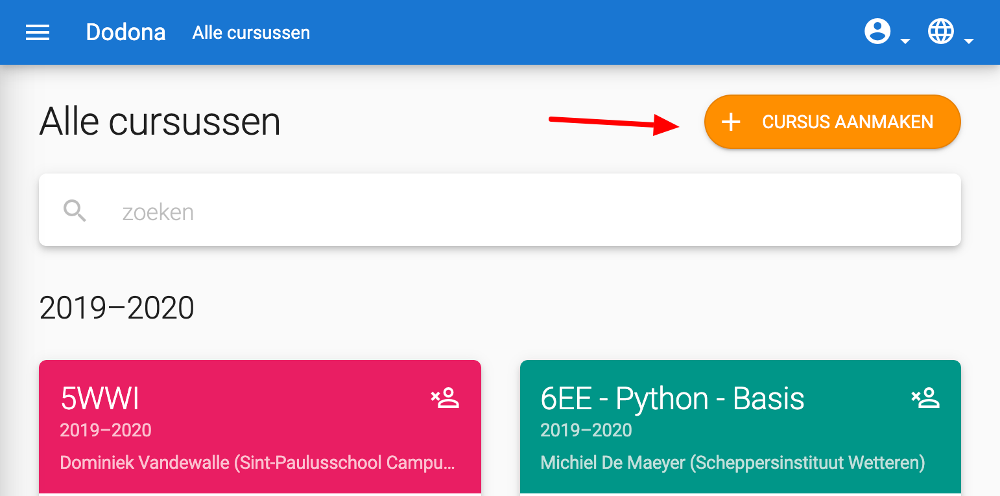

# Van start met Dodona
{: .no_toc }

Alle informatie om vlot van start te gaan met Dodona.
{: .fs-6 .fw-300 }

## Inhoudsopgave
{: .no_toc .text-delta }

1. TOC
{:toc}

---

## Wat is Dodona?

Dodona is een online oefenplatform om te leren programmeren. De webapplicatie werd ontwikkeld aan de Universiteit Gent om practica aan grote groepen studenten te ondersteunen. Dodona focust daarom in de eerste plaats op het automatisch testen en geven van feedback op ingediende oplossingen van programmeeroefeningen. Op dit moment ondersteunt Dodona de programmeertalen Python, JavaScript, Java, C#, bash, Prolog, Haskell en R.

Op Dodona kunnen lesgevers een eigen cursus aanmaken, opgebouwd uit verschillende oefeningenreeksen. Ze kunnen hiervoor beroep doen op bestaande cursussen en oefeningen, maar kunnen er ook voor kiezen om zelf aan de slag te gaan en eigen oefeningen op te stellen. Dankzij de ingebouwde *learning analytics* en datavisualisaties is het bovendien eenvoudig om de voortgang van studenten te meten.

Dodona wordt gratis aangeboden voor educatieve doeleinden.

---

## Aanmelden

Aanmelden op Dodona kan via de Smartschool, Office 365 of G Suite account van je school. Dodona krijgt vervolgens je naam, emailadres, en naam van je school doorgestuurd van het gekozen loginsysteem. Op basis hiervan kunnen we je identificeren en maken we automatisch een Dodona-account aan de eerste keer dat je aanmeldt. Je wachtwoord wordt op geen enkel moment naar ons doorgestuurd.

Sommige scholen bieden zowel inloggen via Smartschool als via Office 365 of G Suite aan. Omdat je Dodona-account gekoppeld is aan het gebruikte inlogsysteem, zal twee verschillende Dodona-accounts hebben als je bijvoorbeeld eerst via Smartschool aanmeldt en vervolgens via Office 365.

Om problemen te voorkomen kunnen we voor jouw school de inlogmogelijkheden beperken. Contacteer ons hiervoor op <a href="mailto:dodona@ugent.be"> dodona@ugent.be</a>.

Een standaard Dodona-account kan zich vrij inschrijven voor cursussen en onbeperkt oefeningen indienen. Wil je als lesgever zelf een cursus aanmaken of oefeningen opstellen, dan heb je extra rechten nodig. Contacteer ons op [dodona@ugent.be](mailto:dodona@ugent.be) of via het [contactformulier](https://dodona.ugent.be/nl/contact) en we geven je account zo snel mogelijk de nodige toegangsrechten.

---

## Een cursus aanmaken

Eenmaal we je lesgeversrechten hebben geactiveerd kan zelf een cursus aanmaken door op de knop "cursus aanmaken" te klikken in het [cursusoverzicht](https://dodona.ugent.be/nl/courses/).

Vervolgens kan je kiezen om te starten vanaf een lege cursus, of om de inhoud van een bestaande cursus over te nemen en aan te passen. Om inspiratie op te doen kan je een kijkje nemen in volgende bestaande cursussen:

- **[Informatica](https://dodona.ugent.be/nl/courses/164/)**: een cursus programmeren in Python die gegeven wordt aan het vijfde jaar Wiskunde-Wetenschappen-Informatica van het [Sint-Paulusschool Campus College](https://www.collegewaregem.be/) in Waregem. De cursus en een groot deel van de oefeningen werd opgesteld door [Dominiek Vandewalle](mailto:DominiekVandewalle@sgsintpaulus.be).
- **[Programmeren](https://dodona.ugent.be/nl/courses/88/)**: een cursus programmeren in Python die gegeven wordt door prof. Peter Dawyndt aan de faculteit Wetenschappen van de Universiteit Gent.

- from scratch
- oefeningen kiezen (programmeertaal, middelbaar, ...)
- zelf oefeningen opstellen

---

## Zelf oefeningen opstellen

- linken naar new exercise repo guide
- linken naar (onbestaande) python exercise guide