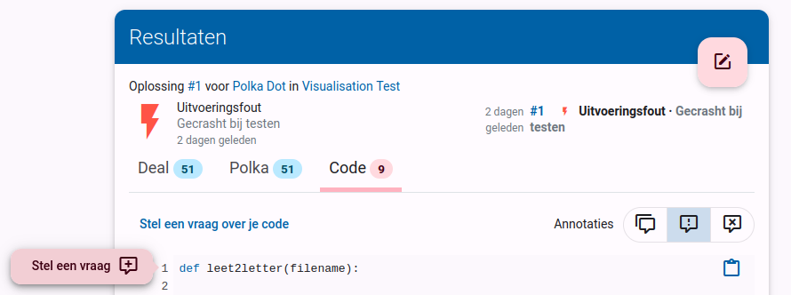
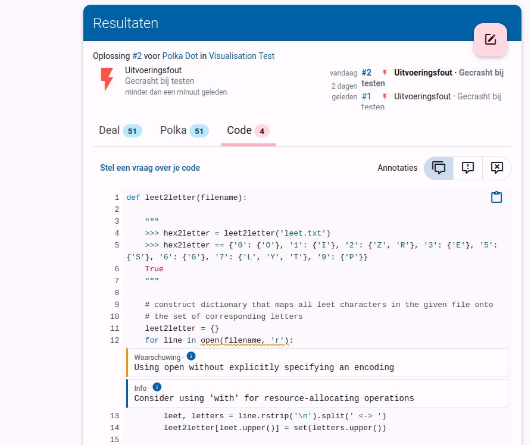

# Vragen en opmerkingen

[[toc]]

## Hoe kan ik vragen stellen over mijn code? <Badge type="tip" text="student" />

::: tip Opmerking
Deze functionaliteit is enkel beschikbaar als je lesgever dit heeft ingeschakeld.
:::

Nadat je je oplossing hebt ingediend, kan je op drie manieren een vraag stellen. Bovenaan de ingediende code kan je een algemene vraag stellen door op `Stel een vraag over je code` te klikken. Daarnaast kan je links van het regelnummer op de roze cirkel klikken een vraag stellen bij een specifieke regel code. Je kan ook een stuk code selecteren en dan hierover vragen stellen via diezelfde knop.

Typ in het tekstvak de vraag die je aan de lesgever wil stellen. Je kan Markdown gebruiken om je tekst extra opmaak te geven. Klik als laatste op `Vraag stellen`.

::: tip Ondersteuning voor Markdown

Je kan met Markdown extra opmaak toevoegen door:

- asterisken (\*) rond woorden te zetten om het schuin weer te geven. \*schuine tekst\* wordt bijvoorbeeld weergegeven als *schuine tekst*.
- twee asterisken (\**) rond woorden te zetten om het in het vet weer te geven. \*\*vette tekst\*\* wordt bijvoorbeeld weergegeven als **vette tekst**.
- backticks (\`) rond een stukje code te zetten. \`Variabelen\` wordt bijvoorbeeld weergegeven als `Variabelen`.

Bekijk hier [alle mogelijkheden van Markdown](/nl/references/exercise-description/#markdown).
:::

Daarnaast kan je ook reageren op een bestaande vraag van jezelf of op een opmerking van een lesgever. Klik hiervoor op `Reageer` onder de vraag of opmerking. Typ je reactie in het tekstvak en klik op `Reageer`.

## Hoe weet ik of mijn vraag beantwoord is? <Badge type="tip" text="student" />

Wanneer een lesgever je vraag beantwoordt, krijg je een melding in Dodona. Deze melding zal je doorverwijzen naar de pagina waar je de vraag stelde.

## Hoe kan ik vragen voor studenten inschakelen/uitschakelen? <Badge type="tip" text="lesgever" />

Gebruik het potloodje in de bovenste navigatiebalk van je cursus om naar de pagina `bewerken` te gaan. Hier kan je vragen voor studenten inschakelen of uitschakelen door het vakje `Sta toe dat studenten vragen stellen` aan of uit te vinken.

Vergeet niet om je wijzigingen op te slaan door op het roze vinkje bovenaan rechts op de pagina te klikken.

## Hoe weet ik of er open vragen zijn? <Badge type="tip" text="lesgever" />

Als er open vragen zijn binnen een cursus, zal je een melding zien in de cursuskaart op je startpagina.

Je zal ook een melding zien in de bovenste navigatiebalk van je cursus. Klik op de melding om naar de pagina te gaan waar je alle open vragen kan zien.

Als je alle open vragen over al je cursussen wil zien, kan je naar de pagina `vragen` gaan in de linkse navigatiebalk van Dodona.

## Hoe kan ik een vraag beantwoorden? <Badge type="tip" text="lesgever" />

Je kan een antwoord typen op de vraag door op het invoerveld te klikken. Terwijl je typt, zal de vraag gemarkeerd worden als in behandeling, om andere lesgevers te verwittigen dat iemand er al mee bezig is.
Wanneer je jouw antwoord afwerkt, zal de vraag gemarkeerd worden als beantwoord en krijgt de student een melding.

Je kan ook direct een vraag markeren als beantwoord. Dit is vaak handig als je weet dat de student de vraag al opgelost heeft op een andere manier. Bijvoorbeeld als de student een andere oplossing ingediend heeft waar het probleem opgelost is, of als je de vraag beantwoord hebt buiten Dodona.

## Hoe kan ik opmerkingen geven op een oplossing van een student? <Badge type="tip" text="lesgever" />

Als lesgever kan je ook opmerkingen geven op de code van je studenten. Dit kan handig zijn om feedback te geven op hun oplossing, of om een fout aan te duiden.

> Als je alle oplossingen van je studenten wil overlopen en feedback wil geven, kan het handig zijn om [een evaluatie aan te maken](/nl/guides/teachers/grading).

Je kan een algemene opmerking toevoegen door op de knop `Globale opmerking toevoegen` te klikken. Je kan ook een stuk code selecteren en op de knop `Voeg opmerking toe` klikken om een opmerking toe te voegen over dat specifieke stuk code.

> Terzijde: opmerkingen ondersteunen Markdown, dus je kan gebruik maken van vet, cursief, lijsten, ... Je kan alle Markdown features bekijken in [deze referentie](/nl/references/exercise-description/#markdown).

## Hoe kan ik opmerkingen opslaan en hergebruiken? <Badge type="tip" text="lesgever" />
Studenten maken vaak dezelfde fouten, of hebben gelijkaardige vragen. Om te vermijden dat je dezelfde opmerkingen steeds opnieuw moet schrijven, kan je opmerkingen hergebruiken.

Tijdens het schrijven of bewerken van een opmerking kan je `opmerking opslaan` aanvinken. Dit zal je toelaten om een titel toe te voegen aan de opmerking, wat je zal helpen om de opmerking in de toekomst terug te vinden.

Je kan ook een bestaande opmerking opslaan door op `opmerking opslaan` te klikken in het menu van de opmerking.

Eenmaal je een of meerdere opmerkingen hebt opgeslagen, krijg je een zoekveld te zien wanneer je een nieuwe opmerking schrijft. Selecteer de gewenste opmerking uit de lijst om deze te hergebruiken. Je kan de opmerking nog steeds bewerken voor je deze post.

## Waarom vind ik mijn opgeslagen opmerkingen niet terug? <Badge type="tip" text="lesgever" />

Opgeslagen opmerkingen worden gegroepeerd per oefening, cursus en gebruiker. Dit betekent dat je een opmerking kan opslaan voor een oefening, en deze opmerking kan hergebruiken in alle oplossingen van die oefening. 

Als je een opmerking wil hergebruiken in een andere oefening, zal je deze opnieuw moeten opslaan. We onderzoeken momenteel hoe we dit kunnen verbeteren.

Je kan een overzicht van al je opgeslagen opmerkingen voor een bepaalde oefening vinden door op de link onder het zoekveld te klikken.

