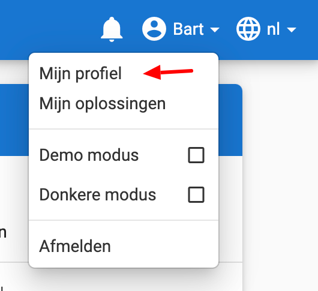

# FAQ: API en API tokens

[[toc]]

## Wat is een API token?

Een API token is een unieke identificatiecode waarmee externe applicaties namens jouw account met Dodona kunnen communiceren zonder jouw wachtwoord nodig te hebben. Het fungeert als een authenticatiesleutel die deze applicaties kunnen gebruiken om acties namens jou uit te voeren. Je kunt bijvoorbeeld een API-token gebruiken om de [Dodona-plugin voor JetBrains IDE's](/nl/faq/ide-plugins/) toegang te geven tot jouw Dodona-account.

## Hoe maak ik een API token aan?

Volg de onderstaande stappen om een API token aan te maken op Dodona:

1. **Ga naar je profielpagina**: Navigeer naar je profielpagina door op de juiste link in het navigatiemenu bovenaan de pagina te klikken. Je kunt ook direct naar [dodona.be/profile](https://dodona.be/nl/profile) gaan.
  

22. **Genereer een nieuw token**: Als je op je profielpagina bent, scroll je naar het midden van de pagina en klik je op de knop `+` om een nieuw token te genereren. Je moet een beschrijving invoeren voor je token (bijvoorbeeld "pycharm"). Deze beschrijving kan je in later helpen om een specifiek token te identificeren.
  

3. **Kopieer het token**: Eenmaal het token is aangemaakt, kan je het kopiëren in het dialoogvenster van de toepassing die je toegang wil geven tot je Dodona-account, bijvoorbeeld de PyCharm-plugin.
  

::: tip
Houd er rekening mee dat je om veiligheidsredenen de tokens niet kunt bekijken op Dodona nadat ze zijn aangemaakt. Je kunt echter wel een lijst van al je actieve tokens bekijken. Je kunt een token op elk moment verwijderen en het zal onmiddellijk stoppen met werken.
:::

## Hoe kan ik de Dodona API gebruiken?

::: warning
Als je een applicatie, tool of plugin wilt bouwen die de Dodona API gebruikt, neem dan contact met ons op via [dodona@ugent.be](mailto:dodona@ugent.be) zodat we je kunnen helpen. Zo kunnen we je ook op de hoogte brengen als we de API wijzigen.
:::

Veel van de acties die je kunt uitvoeren op Dodona kunnen ook worden gedaan via de API. Helaas hebben we nog geen volledige documentatie van de API. De eenvoudigste manier om te controleren of een bepaalde actie mogelijk is via de API is door `.json` toe te voegen aan het einde van de URL. Als je bijvoorbeeld een lijst wilt van alle uitgelichte cursussen op Dodona, kun je naar [dodona.be/courses.json?tab=featured](https://dodona.be/courses.json?tab=featured) gaan. Dit geeft een JSON-object met alle uitgelichte cursussen op Dodona.

Voor endpoints waar je voor ingelogd moet zijn, kan je een [API token](#wat-is-een-api-token) gebruiken om je te authenticeren. Dit kan je doen door het token toe te voegen aan een `Authorization` header bij je request:

```bash
curl \
  -H "Authorization: {YOUR TOKEN}" \
  -H "Accept: application/json" \
  "https://dodona.be/nl/submissions.json"
```

In Python ziet dit er als volgt uit:

```python
#!/usr/bin/python3
# Name: Get submissions
# By Robbert Gurdeep Singh
######################################################################
TOKEN = "TOKEN HERE"


import http.client
conn = http.client.HTTPSConnection("dodona.be")
headers = {
    "Content-type": "application/json",
    "Accept": "application/json",
    "Authorization" : TOKEN
}

conn.request("GET", "/nl/submissions.json", headers=headers)
res = conn.getresponse()
print(res.status, res.reason)
data = res.read()
conn.close()
print(data)
```
