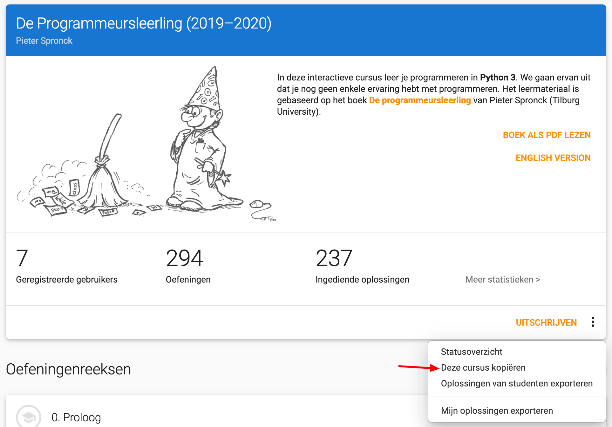

# FAQ: Uitgelichte cursussen

[[toc]]

## Wat is een uitgelichte cursus?

Een 'Uitgelichte Cursus' op Dodona is een cursus die gemarkeerd of aanbevolen is vanwege de educatieve inhoud, kwaliteit of relevantie voor een bepaald onderwerp of vaardigheid. Uitgelichte cursussen worden gekozen door Team Dodona.

Het doel van uitgelichte cursussen is om gebruikers te helpen navigeren door het brede aanbod van beschikbare cursussen en om cursussen te identificeren die bijzonder nuttig zijn of goed aangeschreven staan. Deze cursussen zijn niet gemaakt door Team Dodona.

## Ik heb een cursus gemaakt, hoe kan ik deze laten uitlichten?

Als je een cursus hebt gemaakt en deze op Dodona als uitgelichte cursus wilt laten zien, neem dan contact op met Team Dodona via het [contactformulier](https://dodona.ugent.be/nl/contact) of door een e-mail te sturen naar [dodona@ugent.be](mailto:dodona@ugent.be).

## Hoe kan ik een uitgelichte cursus gebruiken?

Als student kun je een uitgelichte cursus op dezelfde manier gebruiken als elke andere cursus op Dodona. Je kunt je inschrijven voor de cursus met de knop bovenaan de pagina en het materiaal in je eigen tempo doorlopen. Je kunt ook oplossingen voor de programmeeroefeningen insturen en direct feedback op je werk krijgen.

Als lesgever raden we je aan om een kopie te maken van de cursus en deze te gebruiken als uitgangspunt voor je eigen cursus. Op deze manier kun je het leerpad van de cursus aanpassen, deadlines instellen, de voortgang van studenten volgen, toetsen en examens organiseren, ingediende oplossingen beoordelen en collega's aanstellen als mede-cursusbeheerders.

::: tip
Zie je de knop 'Deze cursus kopiëren' niet? Waarschijnlijk heb je niet de nodige rechten om een cursus te kopiëren. Vul het [aanvraagformulier voor lesgevers](https://dodona.ugent.be/nl/rights_requests/new/) in om de benodigde rechten aan te vragen en we nemen zo snel mogelijk contact met je op.
:::

## Welke uitgelichte cursussen zijn er beschikbaar?

De actuele lijst met uitgelichte cursussen kun je vinden op de [aanbevolen cursussen pagina](https://dodona.ugent.be/nl/courses/?tab=featured) van Dodona. Op dit moment hebben we alleen uitgelichte cursussen voor R en Python.

### De programmeursleerling

**De programmeursleerling** van Pieter Spronck (Universiteit van Tilburg) is een gratis, [online leerboek](http://www.spronck.net/pythonbook/dutchindex.xhtml) om te leren programmeren met Python 3. Het is geschikt voor een eerste cursus programmeren voor computerwetenschappers, ingenieurs en studenten in andere disciplines.

Dodona biedt een interactieve versie van dit boek, beschikbaar in zowel het [Nederlands](https://dodona.ugent.be/nl/courses/293/) als [Engels](https://dodona.ugent.be/en/courses/296/).

<iframe width="560" height="315" src="https://www.youtube.com/embed/eAp-ftrZQDE" allow="accelerometer; autoplay; encrypted-media; gyroscope; picture-in-picture" allowfullscreen></iframe>

---

### Python-oefeningen bij Youtube-video's UHasselt

**Python-oefeningen bij Youtube videoreeks UHasselt** is een inleidende Python-cursus die een reeks [YouTube-video's](https://www.youtube.com/playlist?list=PL2iW_rkiCt7UqxL47lGkBaTgApj_QHJ0K) combineert met oefeningen op Dodona. De cursus is gemaakt door Dirk Peeters.

De cursus is alleen beschikbaar in het [Nederlands](https://dodona.ugent.be/nl/courses/290/).

---

### R Basis

**R Basics** is een interactieve cursus waarin je een basis in R opbouwt en de basis leert om met data om te gaan. De cursus is gebaseerd op het eerste deel van het e-book [Introduction to Data Science](https://rafalab.github.io/dsbook/) van Prof. Rafael Irizarry, Department of Data Sciences aan het Dana-Farber Cancer Institute en Department of Biostatistics Harvard School of Public Health.

De cursus is alleen beschikbaar in het [Engels](https://dodona.ugent.be/nl/courses/335/).

---

### R Gegevensverkenning en -visualisatie

**R Data Exploration and Visualisation** is een interactieve cursus waarin je de basisprincipes van datavisualisatie leert en hoe je die kunt toepassen met ggplot2. De cursus is gebaseerd op het tweede deel van het e-book [Introduction to Data Science](https://rafalab.github.io/dsbook/) van Prof. Rafael Irizarry, Department of Data Sciences aan het Dana-Farber Cancer Institute en Department of Biostatistics Harvard School of Public Health.

De cursus is alleen beschikbaar in het [Engels](https://dodona.ugent.be/nl/courses/345/).
