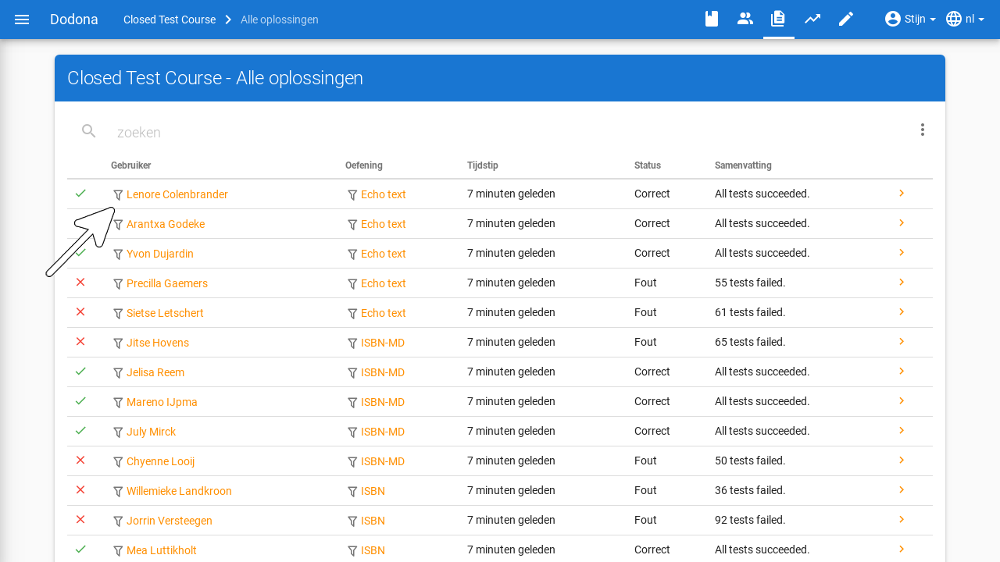
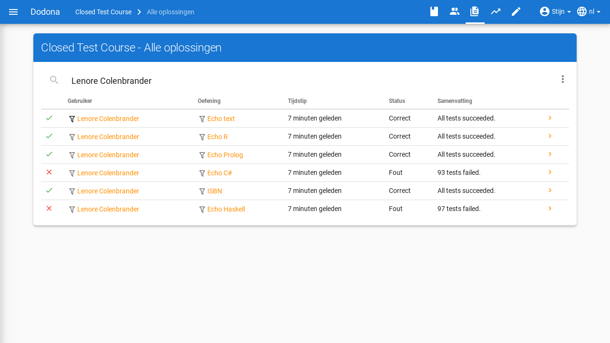

# Cursusbeheer

**Inhoudsopgave**
[[toc]]

Een cursus wordt opgebouwd als een leerpad met oefeningen die gebundeld worden in oefeningenreeksen. De opeenvolging van oefeningenreeksen impliceert een mogelijke volgorde waarin de oefeningen kunnen opgelost worden. Gebruikers kunnen zich registreren voor de cursus via de gekozen registratieprocedure. Er is altijd minstens één gebruiker die cursusbeheerder is, bijvoorbeeld de gebruiker die de cursus aanmaakte. Voor informatie over hoe je een nieuwe cursus aanmaakt, kan je [hier](../new-course) terecht.

## Beheersrechten

Binnenin een cursus kunnen gebruikers bepaalde beheersrechten hebben. We onderscheiden twee rollen: student en cursusbeheerder. Een normale gebruiker is een student en kan zijn/haar gebruikersprofiel bewerken, zich registreren voor cursussen en oplossingen indienen voor oefeningen. Anderzijds is er minstens één cursusbeheerder. De persoon die de cursus aanmaakt wordt automatisch aangesteld als eerste cursusbeheerder. Deze persoon krijget alle permissies van studenten en kan bovendien ook cursusbeheerders aanduiden, oplossingen van studenten bekijken en de cursus zelf bewerken. Deze acties worden verderop uitgelegd.

## Cursus bewerken

Om de eigenschappen van een bestaande cursus te bewerken, navigeer je naar de cursuspagina en klik je op het bewerken-icoontje bovenaan.

Je komt op een pagina terecht waar je de naam, lesgevers, beschrijving, academiejaar, zichtbaarheid en registratieprocedure kan aanpassen. Voor meer details over de specifieke eigenschappen kan je terecht op [deze pagina](../new-course/#cursuseigenschappen). Je kan hier ook de geheime link naar je cursus vernieuwen. Daarvoor klik je op de vernieuwknop naast de [registratielink](#registratielink) om de cursus opnieuw te verbergen nadat de registratielink gedeeld werd. Daardoor wordt een nieuw token gegenereerd en wordt het oude token onbruikbaar gemaakt. De registratielink wordt meteen ook aangepast aan het nieuwe token.

Klik na het aanpassen op de afwerkknop in de rechterbovenhoek van het paneel om de nieuwe cursuseigenschappen effectief in te stellen.  Alternatief kan je ook op de `AANPASSEN` klikken onderaan het paneel. Daarna navigeer je automatisch terug naar de cursuspagina waar de nieuwe cursuseigenschappen onmiddellijk van toepassing zijn.

Als je het bewerken wil onderbreken zonder je wijzigingen op te slaan, klik dan op de cursus in de navigatiebalk.

## Een cursus opbouwen

Als cursusbeheerder kan je voor de cursus een leerpad uitstippelen. Het leerpad wordt op de cursuspagina weergegeven onder de hoofding `Oefeningenreeksen`. Aan het leerpad kan je oefeningenreeksen toevoegen waaraan je oefeningen kunt koppelen. Voor meer uitleg over wat je allemaal kan doen, zie [oefeningenreeksen beheren](../exercise-series-management).

## Cursusgebruikers beheren

Om een overzicht te krijgen van de gebruikers in een cursus, klik je op het gebruikersicoontje in de navigatiebalk bovenaan de cursuspagina. Voor meer informatie over welke acties je daar kan uitvoeren, kan je de tutorial over [gebruikersbeheer](../user-management) raadplegen.

## Navigeren naar oplossingen

Als cursusbeheerder kan je een overzicht met oplossingen die in de cursus ingediend werden, verkrijgen door te klikken op `Ingediende oplossingen` op de cursuspagina of op het icoontje in de navigatiebalk.

Het overzicht bevat alle benodige informatie per inzending, zoals de naam van de gebruiker en de naam van de oefening, inclusief filters voor deze waarden. Ook de status, het tijdstip en een link naar de inzending zijn aanwezig.

Het klikken op een filter zorgt ervoor dat je enkel inzendingen ziet van een specifieke gebruiker of een specifieke oefening. Bovendien kan je ze combineren.

Deze pagina's kan je ook op andere manieren bereiken. 
* De oplossingen voor een specifieke oefening kan je vinden via het pijltje in de rij van die oefening.
* De oplossingen van een specifieke gebruiker vind je door te klikken op `OPLOSSINGEN` op de [cursuspagina van die gebruiker](../user-management/#studenten-opvolgen).

Het overzicht heeft voor cursusbeheerders ook een menu met filters en acties die voor hen voorbehouden zijn:

* `Meest recente correcte oplossing per gebruiker` (filter)

Beperkt het overzicht tot de meest recente correcte oplossing per gebruiker.

* `Oplossingen herevalueren` (actie)

[Herevalueert](../exercise-series-management/#oplossing-herevalueren) alle oplossingen uit het overzicht.
