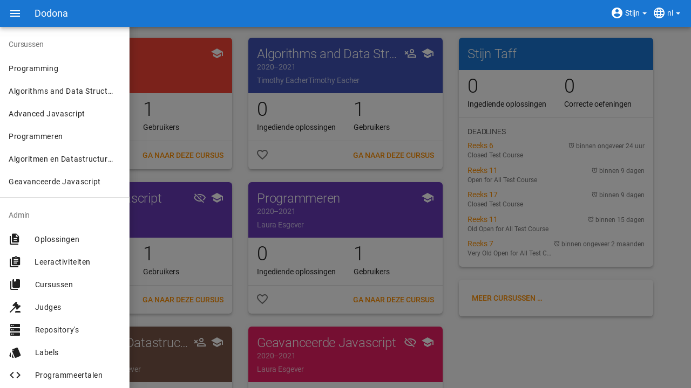
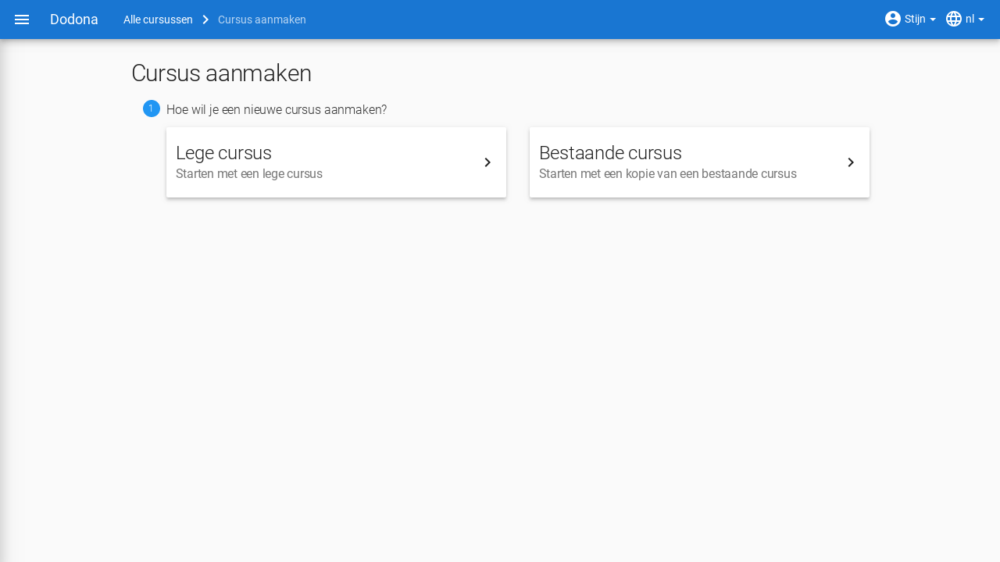
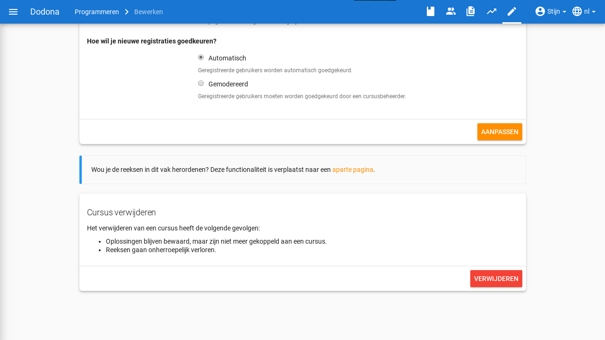
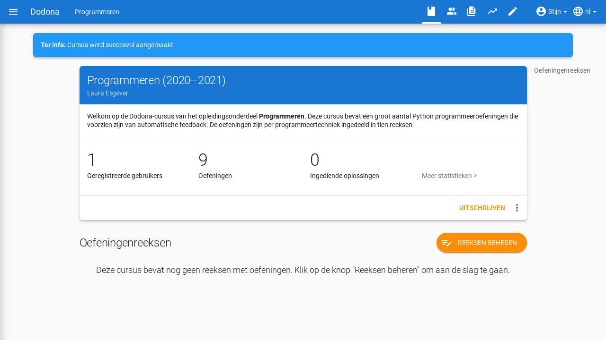
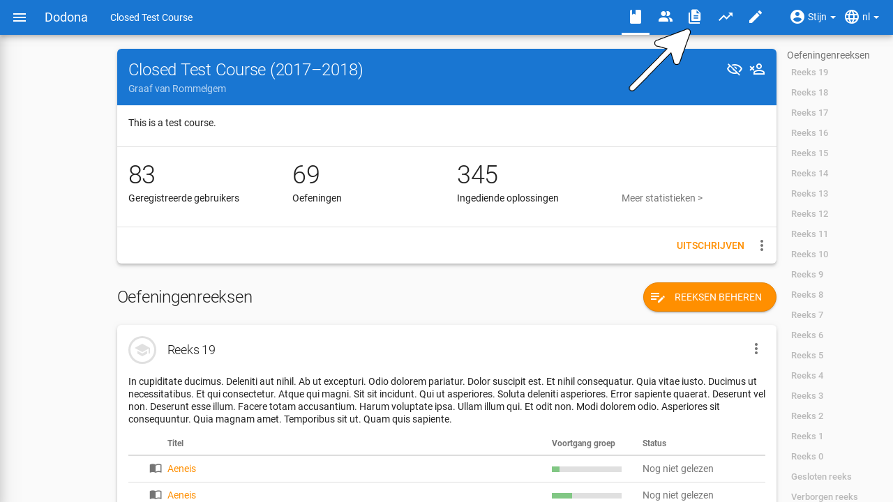

# Cursusbeheer

[[toc]]

Een cursus wordt opgebouwd als een [leerpad](#leerpad) met oefeningen die gebundeld worden in oefeningenreeksen. De opeenvolging van oefeningenreeksen impliceert een mogelijke volgorde waarin de oefeningen kunnen opgelost worden.

## Beheersrechten

Binnenin een cursus kunnen de volgende beheersrechten toegekend worden:

 | naam                                          | icoontje                                |permissies|
 | ----------------------------------------------|-----------------------------------------|----------|
 | `Student`|   *geen*|                                  studenten kunnen hun gebruikersprofiel bewerken, kunnen zich registreren voor cursussen en kunnen oplossingen indienen voor oefeningen|
|`Cursusbeheerder`| |cursusbeheerders krijgen alle permissies van studenten en kunnen bovendien ook cursusbeheerders aanduiden, oplossingen van studenten bekijken en de cursus zelf bewerken| 
 |`Lesgever`|     |   lesgevers hebben de permissies van cursusbeheerder als ze de cursus aanmaken en kunnen bovendien ook cursussen aanmaken en oefeningen of judges toevoegen aan Dodona.|

Om de lesgever-rol te verkrijgen, dien je contact op te nemen met team Dodona. 

::: tip

Je herkent dat je lesgeve bent als je het beheersmenu (menu `Admin`) ziet wanneer je de aan de linkerkant van de pagina het hamburgermenu openklikt.

:::

## Cursus aanmaken

Als lesgever kan je een nieuwe cursus aanmaken door op de knop `CURSUS AANMAKEN` te drukken in de rechterbovenhoek van het cursusoverzicht.

Om een nieuwe cursus aan te maken, zijn er twee opties. Ofwel vertrek je vanaf een reeds bestaande cursus, ofwel maak je een volledige nieuwe cursus aan.

Druk op `Dodona` in de [navigatiebalk](../for-students#navigatiebalk) om het aanmaken van de cursus te annuleren.

Als je vertrekt vanaf een bestaande cursus, dan moet je deze selecteren in de tabel. Via de zoekbalk kan je filteren om snel de gewenste cursus te vinden. Klik het bolletje in de linkerkolom aan om je keuze te bevestigen.

Vervolgens moet je aangeven welke elementen van de [cursus](#cursus) je wil overnemen. De reeksstructuur wordt altijd gekopieerd. Je kan dan nog kiezen of je de oefeningen, de deadlines en de begeleiders wil overnemen. Ten slotte kan je ook andere instellingen kiezen.

`Zet de gekopieerde reeksen op verborgen`:  dit is zeer handig als je elke week een nieuwe reeks zichtbaar wil maken zonder ze eerst onzichtbaar te moeten maken.

## Cursuseigenschappen instellen
Bij beide keuzes moet je kiezen welke eigenschappen je cursus heeft. Deze worden vooraf ingevuld met de waarden van de gekopieerde cursus indien deze optie gekozen werd. Volgende eigenschappen kunnen ingesteld worden.

* `Naam`

Een naam voor de cursus. Verschillende curssen kunnen dezelfde naam hebben. Het is echter aangeraden om cursussen zoveel mogelijk een unieke naam te geven.

* `Lesgevers`

De namen van de lesgevers van de cursus. Gebruik een komma om namen te scheiden als er meerdere lesgevers zijn.

* `Academiejaar`

Het academiejaar waarin de cursus wordt aangeboden. Gebruik het formaat `jjjj-jjjj` om ervoor te zorgen dat de cursus correct gesorteerd wordt op de startpagina en in het [cursusoverzicht](#cursusoverzicht).

* `Zichtbaarheid`
<h1 id="zichtbaarheid"></h1>

De zichtbaarheid bepaalt of [niet-geregistreerde](../for-students#cursus-registreren) gebruikers de cursus kunnen zien. Voor deze eigenschap kunnen de volgende waarden ingesteld worden: 
  * `Zichtbaar`
    Alle gebruikers zien de cursus in het [cursusoverzicht](#cursusoverzicht). Ze kunnen ook naar de [cursuspagina](../for-students#cursuspagina) navigeren en zich daar eventueel voor de cursus registreren.

  * `Verborgen`
    Alleen [cursusbeheerders](#cursusbeheerder) zien de [cursus](#cursus) in het [cursusoverzicht](#cursusoverzicht) en op hun [startpagina](../for-students#startpagina). Er staat een icoontje bij om hen er op te wijzen dat andere gebruikers de cursus daar niet kunnen zien. Dit icoontje is ook te vinden op de [cursuspagina](../for-students#cursuspagina) zelf. Enkel geregistreerde gebruikers kunnen naar deze pagina navigeren. Andere gebruikers kunnen zich enkel voor de cursus registreren als ze de [registratielink](#registratielink) gebruiken.
    

* `Registratieprocedure`

  De registratieprocedure bepaalt of en hoe gebruikers zich voor de cursus kunnen registreren. Voor deze eigenschap kunnen de volgende waarden ingesteld worden:

  * `Open`
    Gebruikers kunnen zich voor de cursus registreren zonder expliciete goedkeuring van een [cursusbeheerder](#cursusbeheerder).
  
  * `Gemodereerd`
  Gebruikers kunnen een [registratieverzoek](../for-students#registratieverzoek) indienen voor de #cursus maar zijn pas geregistreerd als een cursusbeheerder hun registratieverzoek heeft [goedgekeurd](#registratieverzoek-goedkeuren).

  * `Gesloten`
  Gebruikers kunnen zich niet meer voor de cursus registreren.

 ::: tip Belangrijk

 Als je de registratieprocedure aanpast dan blijven bestaande registraties voor de cursus gelden en blijven registratieverzoeken voor de cursus openstaan. Je moet zelf de bestaande registratiestatus van cursusgebruikers aanpassen.
:::

* `Beschrijving`

<h1 id="Markdown"></h1>

Een optionele beschrijving die bovenaan de cursuspagina wordt weergegeven. Voor het opmaken van de beschrijving kan je gebruikmaken van [Markdown](https://en.wikipedia.org/wiki/Markdown). Dodona maakt voor de weergave van Markdown gebruik van [kramdown](https://kramdown.gettalong.org) waardoor heel wat uitbreidingen van de standaard Markdown ondersteund worden. Voor meer uitleg over hoe deze formattering werkt, zie deze [pagina](/nl/references/exercise-description/)

`Registratielink`

Bij het [aanmaken](#cursus-aanmaken) van een cursus wordt automatisch een token gegenereerd als afschermingsmechanisme van [verborgen](#zichtbaarheid) cursussen. Zonder dit token kunnen [niet-geregistreerde](../for-students#cursus-registreren) gebruikers de cursuspagina van een verborgen cursus niet zien en zich daar dus ook niet registreren. Als ze toch naar de cursus proberen te navigeren, dan zien ze enkel een melding dat ze niet de geen toegangsrechten hebben voor de cursus.

Als lesgever ben je verantwoordelijk om de registratielink te delen met je studenten. Zij kunnen zich dan registreren op de cursuspagina waar ze terecht komen via de link. Deze link bevat immers het geheime token dat hen toegang verleent.

De registratielink heeft dus als voordeel dat gebruikers de cursus niet zelf moeten zoeken in het [cursusoverzicht](../for-students#cursusoverzicht) en dat ze meteen een verzoek krijgen om zich voor de cursus te [registreren](../for-students#cursus-registreren) als ze dat nog niet gedaan hadden. Als cursusbeheerder krijg je de verantwoordelijkheid om de registratielink enkel te delen met niet-geregistreerde gebruikers die zich voor een [verborgen](#zichtbaarheid) cursus mogen registreren. Je vindt deze registratielink op de cursus-bewerkenpagina. Druk op de kopieerknop naast de registratielink om de registratielink naar het klembord te kopiëren. 

Druk op de vernieuwknop naast de [registratielink](#registratielink) om de cursus opnieuw te verbergen nadat de registratielink gedeeld werd. Daardoor wordt een nieuw token gegenereerd en wordt het oude token onbruikbaar gemaakt. De registratielink wordt meteen ook aangepast aan het nieuwe token.

Druk op de afwerkknop in de rechteronderhoek van de pagina `CURSUS AANMAKEN` om het aanmaken van een cursus met de opgegeven [eigenschappen](#cursus-eigenschappen) effectief door te voeren.

Na het aanmaken van de nieuwe cursus navigeer je naar de cursuspagina, waar je kunt vaststellen dat je automatisch geregistreerd bent als cursusgebruiker en dat je aangeduid bent als [cursusbeheerder](#cursusbeheerder).

## Cursus navigeren

Je kan de cursuspagina van een [cursus](#cursus) bereiken op verschillende manieren. Vanaf de landingspagina kan je cursussen zoeken door te klikken op `Meer cursussen`. Vanop eender welke pagina kan je via het hamburgermenu in de linkerbovenhoek snelkoppelingen vinden naar jouw cursusssen onder het tabblad `Cursussen` en de cursus-zoekenpagina via het gelijknamige knopje on het tabblad `Admin`. Op de zoeken-pagina kan je filteren op naam van de cursus en op het instituut waartoe de cursus behoort. Ten slotte dien je enkel nog de gewenste cursus aan te klikken om op de cursuspagina terecht te komen.

## Cursus bewerken

Als cursusbeheerder kan je de [eigenschappen](#cursuseigenschappen-instellen) van een cursus aanpassen door op het bewerken-icoontje te drukken bovenaan de cursuspagina.

Druk op de cursus in de [navigatiebalk](../for-students#navigatiebalk) om het aanpassen te annuleren.

Druk na het aanpassen op de afwerkknop in de rechterbovenhoek van het paneel om de nieuwe cursuseigenschappen effectief in te stellen.  Alternatief kan je ook op de `AANPASSEN` drukken onderaan het paneel.

Na het afwerken navigeer je terug naar de cursuspagina waar de nieuwe cursuseigenschappen onmiddellijk van toepassing zijn.

## Leerpad

Als cursusbeheerder kan je voor de cursus een leerpad uitstippelen. Het leerpad wordt op de cursuspagina weergegeven onder de hoofding `Oefeningenreeksen`.Aan het leerpad kan je oefeningenreeksen toevoegen waaraan je oefeningen kunt koppelen. Voor meer uitleg over wat je allemaal kan doen, zie [oefeningenreeksen beheren](../exercise-series-management).

## Cursusgebruikers beheren

Deze informatie is verhuisd naar een aparte [pagina](../user-management).

## Navigeren naar oplossingen

Als cursusbeheerder kan je een overzicht met oplossingen die in de cursus ingediend werden, verkrijgen door te drukken op `Ingediende oplossingen` in de navigatiebalk.
.

Het overzicht bevat alle benodige informatie per inzending, zoals de naam van de gebruiker en de naam van de oefening, inclusief filters voor deze waarden. Ook de status, het tijdstip en een link naar de inzending zijn aanwezig.

Het klikken op een filter zorgt ervoor dat je enkel inzendingen ziet van een specifieke gebruiker of een specifieke oefening. Bovendien kan je ze combineren.

Deze pagina's kan je ook op andere manieren bereiken. 
* De oplossingen voor een specifieke oefening kan je vinden via het pijltje in de rij van die oefening.
* De oplossingen van een specifieke gebruiker vind je door te klikken op `OPLOSSINGEN` op de cursuspagina van die gebruiker.

Het overzicht heeft voor cursusbeheerders ook een menu met filters en acties die voor hen voorbehouden zijn:

* `Meest recente correcte oplossing per gebruiker` (filter)

Beperkt het overzicht tot de meest recente correcte oplossing per gebruiker.

* `Oplossingen herevalueren` (actie)

[Herevalueert](../exercise-series-management#oplossing-herevalueren) alle oplossingen uit het overzicht.
