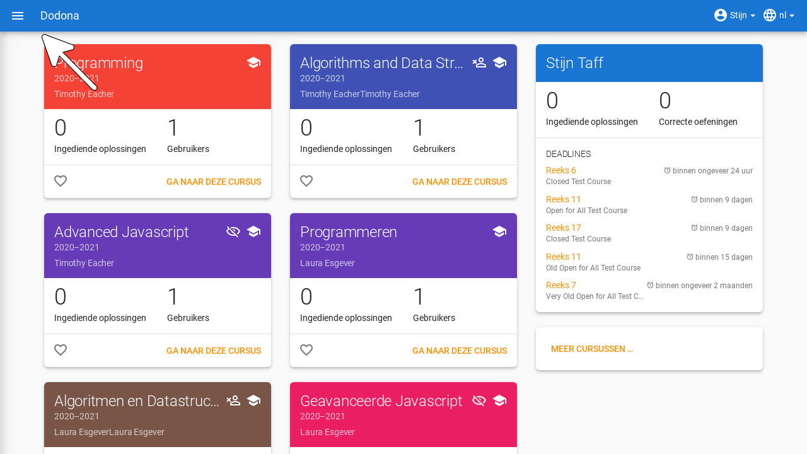
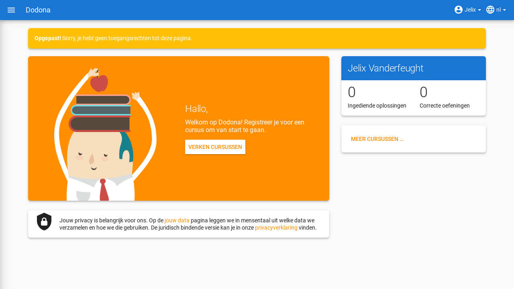
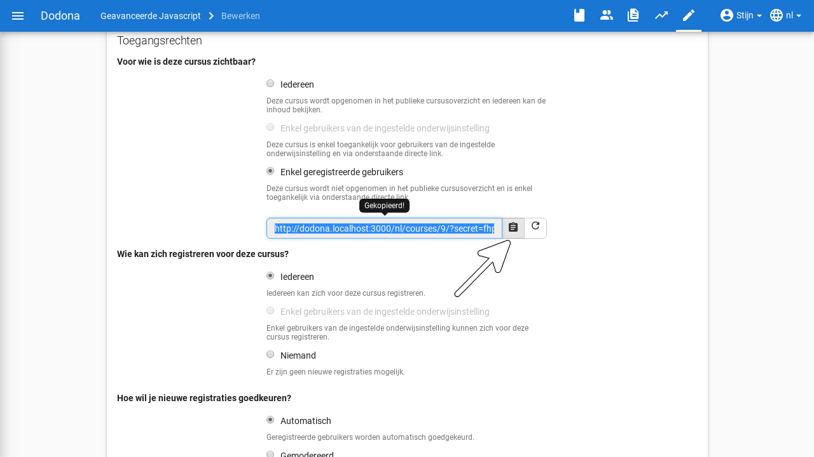

# Cursus aanmaken

Als lesgever kan je een nieuwe cursus aanmaken waar je studenten zich voor kunnen registreren. Dit doe je door op de knop `CURSUS AANMAKEN` te klikken in de rechterbovenhoek van het [cursusoverzicht](https://dodona.ugent.be/nl/courses). Vanaf de landingspagina bereik je dit overzicht door te klikken op `Meer cursussen`. Vanop eender welke pagina kan je via het hamburgermenu in de linkerbovenhoek snelkoppelingen vinden naar jouw cursusssen onder het tabblad `Cursussen` en de cursus-zoekenpagina via het gelijknamige knopje on het tabblad `Admin` als je een lesgever bent.

Om een nieuwe cursus aan te maken, zijn er twee opties. Ofwel vertrek je vanaf een reeds bestaande cursus, ofwel maak je een volledige nieuwe cursus aan.

Als je vertrekt vanaf een bestaande cursus, dan moet je deze selecteren in de tabel. Via de zoekbalk kan je filteren om snel de gewenste cursus te vinden. Klik het bolletje in de linkerkolom aan om je keuze te bevestigen.

Vervolgens moet je aangeven welke elementen van de [cursus](#cursus) je wil overnemen. De reeksstructuur wordt altijd gekopieerd. Je kan dan nog kiezen of je de oefeningen, de deadlines en de begeleiders wil overnemen. Ten slotte kan je ook andere instellingen kiezen.

`Zet de gekopieerde reeksen op verborgen`:  dit is zeer handig als je elke week een nieuwe reeks zichtbaar wil maken zonder ze eerst onzichtbaar te moeten maken.

Voor meer informatie over alle eigenschappen die je kan instellen in je cursus, zie deze [pagina](../course-management#cursuseigenschappen-instellen).

:::tip Belangrijk 

Je hebt extra rechten nodig om een cursus aan te kunnen maken. Contacteer ons op [dodona@ugent.be](mailto:dodona@ugent.be) of via het [contactformulier](https://dodona.ugent.be/nl/contact) en we geven je account zo snel mogelijk de nodige toegangsrechten.

:::

::: tip

Je herkent dat je lesgever bent als je het beheersmenu (menu `Admin`) ziet wanneer je de aan de linkerkant van de pagina het hamburgermenu openklikt.

:::

## Cursuseigenschappen

Bij beide keuzes moet je kiezen welke eigenschappen je cursus heeft. Deze worden vooraf ingevuld met de waarden van de gekopieerde cursus indien deze optie gekozen werd. Volgende eigenschappen kunnen ingesteld worden.

* `Naam`: een naam voor de cursus. Verschillende curssen kunnen dezelfde naam hebben. Het is echter aangeraden om cursussen zoveel mogelijk een unieke naam te geven.

* `Lesgevers`: de namen van de lesgevers van de cursus. Gebruik een komma om namen te scheiden als er meerdere lesgevers zijn.

* `Academiejaar`: het academiejaar waarin de cursus wordt aangeboden. Gebruik het formaat `jjjj-jjjj` om ervoor te zorgen dat de cursus correct gesorteerd wordt op de startpagina en in het cursusoverzicht.

* `Zichtbaarheid`: dit bepaalt of niet-geregistreerde gebruikers de cursus kunnen zien. Voor deze eigenschap kunnen de volgende waarden ingesteld worden: 

  * `Zichtbaar`: alle gebruikers zien de cursus in het cursusoverzicht. Ze kunnen ook naar de cursuspagina navigeren en zich daar eventueel voor de cursus registreren.

  * `Verborgen`: alleen cursusbeheerders zien de cursus in het cursusoverzicht en op hun startpagina. Er staat een icoontje bij om hen er op te wijzen dat andere gebruikers de cursus daar niet kunnen zien. Dit icoontje is ook te vinden op de cursuspagina zelf. Enkel geregistreerde gebruikers kunnen naar deze pagina navigeren. Andere gebruikers kunnen zich enkel voor de cursus registreren als ze de registratielink gebruiken.
  
  

* `Registratieprocedure`: deze eigenschap bepaalt of en hoe gebruikers zich voor de cursus kunnen registreren. Voor deze eigenschap kunnen de volgende waarden ingesteld worden:

  * `Open`: gebruikers kunnen zich voor de cursus registreren zonder expliciete goedkeuring van een cursusbeheerder.
  
  * `Gemodereerd`: gebruikers kunnen een registratieverzoek indienen voor de #cursus maar zijn pas geregistreerd als een cursusbeheerder hun registratieverzoek heeft goedgekeurd.

  * `Gesloten`: gebruikers kunnen zich niet meer voor de cursus registreren.

  ::: tip Belangrijk

  Als je de registratieprocedure aanpast dan blijven bestaande registraties voor de cursus gelden en blijven registratieverzoeken voor de cursus openstaan. Je moet zelf de bestaande registratiestatus van cursusgebruikers aanpassen.
  :::

* `Beschrijving`: optionel stuk dat bovenaan de cursuspagina wordt weergegeven. Voor het opmaken van de beschrijving kan je gebruikmaken van [Markdown](https://en.wikipedia.org/wiki/Markdown). Dodona maakt voor de weergave van Markdown gebruik van [kramdown](https://kramdown.gettalong.org) waardoor heel wat uitbreidingen van de standaard Markdown ondersteund worden. Voor meer uitleg over hoe deze formattering werkt, zie deze [pagina](/nl/references/exercise-description/)

* `Registratielink`: bij het aanmaken van een cursus wordt automatisch een token gegenereerd als afschermingsmechanisme van verborgen cursussen. Zonder dit token kunnen niet-geregistreerde gebruikers de cursuspagina van een verborgen cursus niet zien en zich daar dus ook niet registreren. Als ze toch naar de cursus proberen te navigeren, dan zien ze enkel een melding dat ze niet de geen toegangsrechten hebben voor de cursus.

  

  Als lesgever ben je verantwoordelijk om de registratielink te delen met je studenten. Zij kunnen zich dan registreren op de cursuspagina waar ze terecht komen via de link. Deze link bevat immers het geheime token dat hen toegang verleent.

  

  De registratielink heeft dus als voordeel dat gebruikers de cursus niet zelf moeten zoeken in het [cursusoverzicht](../for-students#cursusoverzicht) en dat ze meteen een verzoek krijgen om zich voor de cursus te [registreren](../for-students#cursus-registreren) als ze dat nog niet gedaan hadden. Als cursusbeheerder krijg je de verantwoordelijkheid om de registratielink enkel te delen met niet-geregistreerde gebruikers die zich voor een verborgen cursus mogen registreren. Je vindt deze registratielink op de cursus-bewerkenpagina. Klik op de kopieerknop naast de registratielink om de registratielink naar het klembord te kopiëren. 

  

Klik op de afwerkknop in de rechteronderhoek van de pagina `CURSUS AANMAKEN` om het aanmaken van een cursus met de opgegeven eigenschappen effectief door te voeren.

Na het aanmaken van de nieuwe cursus navigeer je naar de cursuspagina, waar je kunt vaststellen dat je automatisch geregistreerd bent als cursusgebruiker en dat je aangeduid bent als cursusbeheerder.

