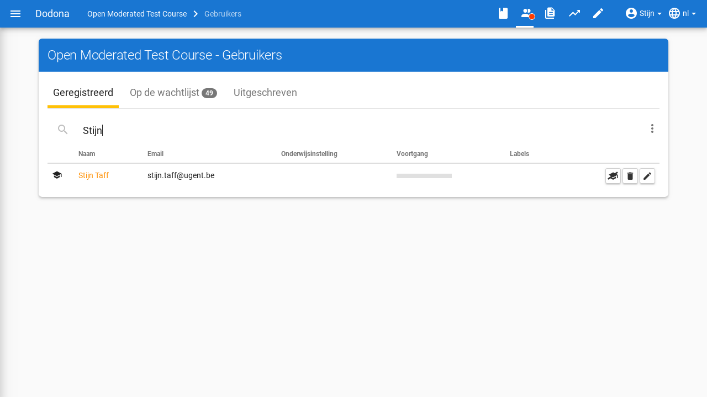

# Gebruikersbeheer

**Inhoudsopgave**
[[toc]]

Als cursusbeheerder krijg je toegang tot alle cursusgebruikers. Dit overzicht bereik je door te klikken op het gebruikersicoontje in de navigatiebalk bovenaan de cursuspagina. Hierin zie je alle gebruikers die ooit voor de cursus [geregistreerd](../for-students#cursus-registreren) geweest zijn of die ooit een [registratieverzoek](../for-students#registratieverzoek) voor de cursus ingediend hebben. Je kunt hun cursusoverzichtspagina bekijken, hun oplossingen bekijken, hun registratiestatus aanpassen en hun beheersrechten wijzigen. De beheersrechten geven aan wat een gebruiker mag doen binnenin een cursus. Voor meer informatie hierover, zie deze [pagina](../course-management#beheersrechten).

## Gebruikersoverzicht

Als lesgever navigeer je naar het gebruikersoverzicht van je cursus door naar je cursus te navigeren en vervolgens op `Geregistreerde gebruikers` te klikken in de cursusbeschrijving. Je kan ook op het gebruikersicoontje klikken in de navigatiebalk.

In het gebruikersoverzicht worden de gebruikersnaam, de naam, het emailadres en [voortgangsstatistieken](#voortgangsstatistieken) opgelijst uit het [gebruikersprofiel](../for-students#gebruikersprofiel) van alle gebruikers van jouw cursus. Voor de naam van elke lesgever en beheerder staat een icoontje dat correspondeert met de beheersrechten die aan de gebruiker [toegewezen](#cursusbeheerders-aanduiden) werden.

### Gebruiker zoeken

Gebruik de zoekbalk bovenaan het gebruikersoverzicht om te zoeken naar specifieke gebruikers op basis van een gebruikersnaam, een naam, een emailadres of gebruikerslabel. Verschillende filters kunnen tegelijkertijd actief zijn.

### Gebruiker voortgangsstatistieken
De voortgangsstatistieken van een gebruiker worden weergegeven middels een vooruitgangsbalkje. Het groen-ingekleurde deel stelt het aandeel oefeningen in de cursus waarvoor de gebruiker een *correcte* oplossing voor heeft ingediend. Het rode gedeelte stelt het aandeel oefeningen voor waar de gebruiker reeds oplossingen voor heeft ingediend, maar nog niet correct heeft opgelost. Het grijze gedeelte stelt de oefeningen voor waar de gebruiker nog niet aan begonnen is.

### Cursusbeheerders aanduiden

Om sommige acties te kunnen uitvoeren op Dodona heb je bijkomende beheersrechten nodig. Als lesgever kan je zien in het gebruikersoverzicht door te kijken naar onderstaande icoontjes. Je kan dan ook de acties aan de rechterkant gebruiken om de beheersrechten van een gebruiker in te stellen. Als lesgever kan je enkel de beheersrechten `Student` en `Cursusbeheerder` toekennen aan gebruikers (inclusief jezelf). Op die manier kan je een gebruiker promoveren tot cursusbegeleider of degraderen tot student. Voor meer informatie rond deze rollen, zie [deze pagina](../course-management#beheersrechten)

Je kan de cursusbeheerders herkennen aan het icoontje in de linkermarge.

Via de knoppen aan de rechterkant kan je de beheersrechten van gebruikers aanpassen.

* : cursusgebruiker zonder beheersrechten voor de cursus promoveren tot cursusbeheerder
* : cursusbeheerder degraderen tot cursusgebruiker zonder beheersrechten voor de cursus

::: tip Belangrijk

Een cursusbeheerder die zich uitschrijft uit een cursus verliest zijn status van cursusbeheerder. Dit geldt dus ook als je jezelf degradeert tot student.

Om ervoor te zorgen dat een cursus altijd minstens één cursusbeheerder heeft, kan de laatste cursusbeheerder zich niet uitschrijven en kan hij zichzelf ook niet degraderen tot cursusgebruiker zonder beheersrechten voor de cursus.

Na het aanmaken van een cursus kan een lesgever zich uitschrijven als hij andere cursusbeheerders aangeduid heeft. Hij kan door andere cursusbeheerders ook gedegradeerd worden tot cursusgebruiker zonder beheersrechten voor de cursus.
:::

### Registratieverzoeken afhandelen

De cursusgebruikers worden in tabs gegroepeerd volgens hun registratiestatus voor de cursus. Elke tab biedt andere acties aan om de registratiestatus van de bijhorende gebruiker aan te passen.

* `Geregistreerd`: alle cursusgebruikers die momenteel geregistreerd zijn.
  Door te klikken op  schrijf je de gebruiker uit de cursus.

* `Op de wachtlijst`: alle cursusgebruikers waarvoor er nog een registratieverzoek openstaat dat wacht op afhandeling door een cursusbeheerder.
  Door te klikken op  keur je het registratieverzoek goed. Afkeuren doe je door te klikken op .

* `Uitgeschreven`: alle cursusgebruikers die ooit geregistreerd waren, maar die ondertussen uitgeschreven zijn.
  Deze gebruiker kan je terug inschrijven voor de cursus door te klikken op 

## Studenten opvolgen
Om de voortgang van een individuele student op te volgen is er een overzichtpagina per student voorzien. Je kan deze pagina raadplegen door in het gebruikersoverzicht van een cursus op de naam van een student te klikken. Op deze pagina krijg je een overzicht van de vooruitgang van een gebruiker binnenin de cursus. Naast enkele statistieken kan je ook de status voor elke oefening en reeks binnen de cursus voor deze student raadplegen.

