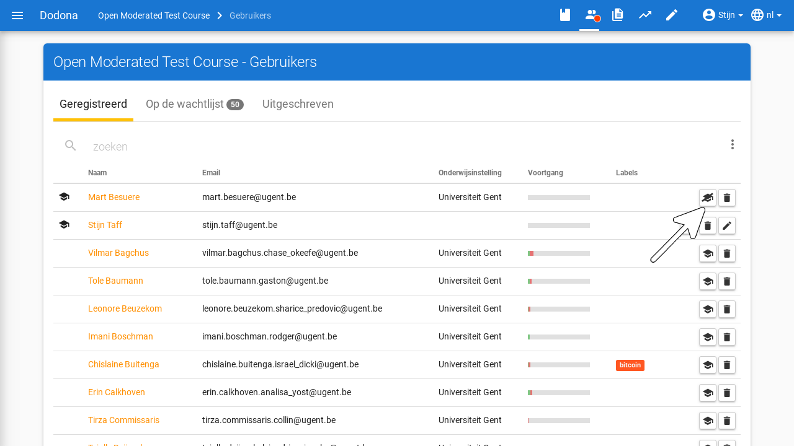
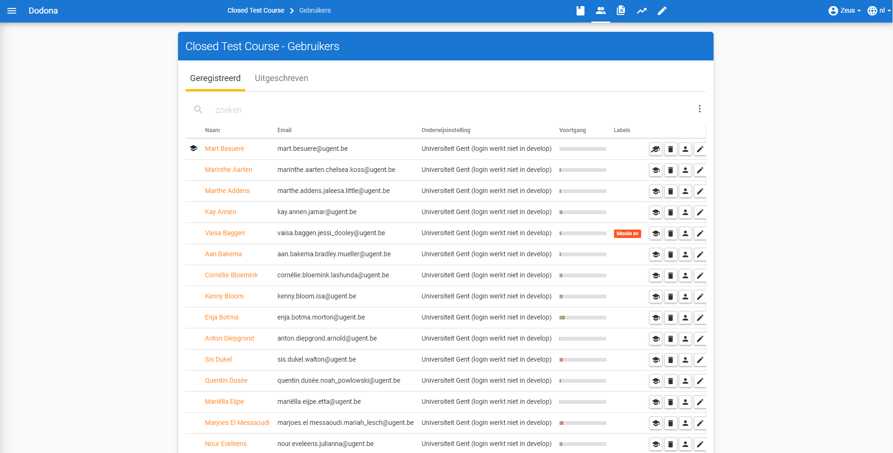

[[toc]]

# Gebruikersbeheer

Als cursusbeheerder krijg je toegang tot alle cursusgebruikers. Dit zijn de gebruikers die ooit voor de cursus [geregistreerd](/nl/for-students#cursus-registreren) geweest zijn of die ooit een [registratieverzoek](/nl/for-students#registratieverzoek) voor de cursus ingediend hebben. Je kunt hun cursusoverzichtspagina bekijken, hun oplossingen bekijken, hun registratiestatus aanpassen en hun beheersrechten wijzigen. De beheersrechten geven aan wat een gebruiker mag doen binnenin een cursus. Voor meer informatie hierover, zie deze [pagina](/nl/guides/course-management#beheersrechten).

## Beheersrechten

Om sommige acties te kunnen uitvoeren op Dodona heb je bijkomende beheersrechten nodig. Als lesgever kan je zien in het [gebruikersoverzicht](#gebruikersoverzicht) door te kijken naar onderstaande icoontjes. Je kan dan ook de acties aan de rechterkant gebruiken om de beheersrechten van een gebruiker in te stellen. Als lesgever kan je enkel de beheersrechten `Student` en `Cursusbeheerder` toekennen aan gebruikers (inclusief jezelf). Op die manier kan je een gebruiker promoveren tot cursusbegeleider of degraderen tot student. Voor meer informatie rond deze rollen, zie [deze pagina](/nl/guides/course-management#beheersrechten)

::: tip Belangrijk

Als je jezelf als [lesgever](#lesgever)
degradeert tot [student](#student), dan
kan je jezelf daarna niet terug promoveren tot lesgever.
:::

Aan gebruikers kunnen de volgende
[beheersrechten](#beheersrechten)
toegekend worden:

 | naam                                          | icoontje                                |permissies|
 | ----------------------------------------------|-----------------------------------------|----------|
 | `Student`|   *geen*|                                  studenten kunnen hun gebruikersprofiel bewerken, kunnen zich registreren voor cursussen en kunnen oplossingen indienen voor oefeningen|
|`Cursusbeheerder`| |cursusbeheerders krijgen alle permissies van studenten en kunnen bovendien ook cursusbeheerders aanduiden, oplossingen van studenten bekijken en de cursus zelf bewerken| 
 |`Staff`|     |   lesgevers hebben de permissies van cursusbeheerder als ze de cursus aanmaken en kunnen bovendien ook cursussen aanmaken en oefeningen of judges toevoegen aan Dodona|

 
::: tip

Je herkent dat je [lesgever](#lesgever) bent als je het beheersmenu (menu `Admin`) ziet wanneer je de aan de linkerkant van de pagina het hamburgermenu openklikt.

:::

## Gebruikersoverzicht

Als lesgever navigeer je naar het gebruikersoverzicht van je cursus door naar je cursus te navigeren en vervolgens op `Geregistreerde gebruikers` te klikken in de cursusbeschrijving. Je kan ook op het gebruikersicoontje klikken in de navigatiebalk.

In het gebruikersoverzicht worden de gebruikersnaam, de naam, het emailadres en [voortgangsstatistieken](#voortgangsstatistieken) opgelijst uit het [gebruikersprofiel](/nl/for-students#gebruikersprofiel) van alle gebruikers van jouw cursus. Voor de naam van elke lesgever en beheerder staat een icoontje dat correspondeert met de beheersrechten die aan de gebruiker [toegewezen](#cursusbeheerders-aanduiden) werden.

### Gebruiker zoeken
Gebruik de zoekbalk bovenaan het gebruikersoverzicht om te zoeken naar specifieke gebruikers op basis van een gebruikersnaam, een naam, een emailadres of gebruikerslabel. Verschillende filters kunnen tegelijkertijd actief zijn.

### Gebruiker selecteren
Druk op de naam om naar de [cursusoverzichtspagina](#cursusoverzichtspagina) van de gebruiker te navigeren.

### Gebruiker voortgangsstatistieken
De voortgangsstatistieken van een gebruiker worden weergegeven middels een vooruitgangsbalkje. Het groen-ingekleurde deel stelt het aandeel oefeningen in de cursus waarvoor de gebruiker een *correcte* oplossing voor heeft ingediend. Het rode gedeelte stelt het aandeel oefeningen voor waar de gebruiker reeds oplossingen voor heeft ingediend, maar nog niet correct heeft opgelost. Het grijze gedeelte stelt de oefeningen voor waar de gebruiker nog niet aan begonnen is.

### Cursusbeheerders aanduiden

Je kan de cursusbeheerders herkennen aan het icoontje in de linkermarge.

Je kan de volgende actieknoppen aan de rechterkant gebruiken om cursusbeheerders aan te duiden:

|knop                                                              |actie                                                                                |
|------------------------------------------------------------------|-------------------------------------------------------------------------------------|
    |cursusgebruiker zonder beheersrechten voor de cursus promoveren tot cursusbeheerder  |
         |cursusbeheerder degraderen tot cursusgebruiker zonder beheersrechten voor de cursus  |

::: tip Belangrijk

Een cursusbeheerder die zich uitschrijft uit een cursus verliest zijn status van cursusbeheerder.

Om ervoor te zorgen dat een cursus altijd minstens één cursusbeheerder heeft, kan de laatste cursusbeheerder zich niet uitschrijven en kan hij zichzelf ook niet degraderen tot cursusgebruiker zonder beheersrechten voor de cursus.

Na het aanmaken van een cursus kan een lesgever zich uitschrijven als hij andere cursusbeheerders aangeduid heeft. Hij kan door andere cursusbeheerders ook gedegradeerd worden tot cursusgebruiker zonder beheersrechten voor de cursus.
:::

### Registratiestatus aanpassen

De cursusgebruikers worden in tabs gegroepeerd volgens hun registratiestatus voor de cursus. De volgende statussen zijn mogelijk:

* `Geregistreerd`

  Alle cursusgebruikers die momenteel geregistreerd zijn.

* `Uitgeschreven`

  Alle cursusgebruikers die ooit geregistreerd waren, maar die ondertussen uitgeschreven zijn.

* `Op de wachtlijst`

  Alle cursusgebruikers waarvoor er nog een registratieverzoek openstaat dat wacht op afhandeling door een cursusbeheerder.

### Registratieverzoeken afhandelen

Elke tab heeft eigen actieknoppen aan de rechterkant van de cursusgebruikers waarmee je hun registratiestatus kunt aanpassen.

|tab                                                 |knop                    |actie |
-----------------------------------------------------|------------------------|------| 
`Geregistreerd`|           |  cursusgebruiker uitschrijven uit de cursus|
`Uitgeschreven`|          |     cursusgebruiker terug registreren voor de cursus|
`Registratieverzoeken`|   |     goedkeuren van het registratieverzoek, waardoor de gebruiker geregistreerd wordt voor de cursus|
`Registratieverzoeken`|   |      afkeuren van het registratieverzoek, waardoor de gebruiker uitgeschreven wordt uit de cursus|

## Cursusoverzichtspagina

Op deze pagina krijg je een overzicht van de vooruitgang van een gebruiker binnenin de cursus. Je krijgt de voortgangsstatistieken te zien, alsook grafieken over de activiteiten van deze gebruiker en een overzicht per reeks van de status van elke oefening.

