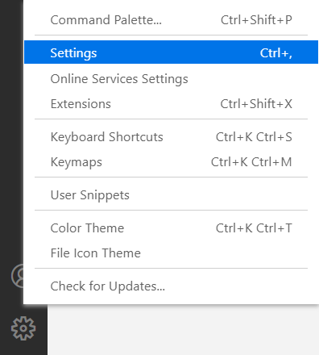

# Dodona VS Code extensie

Als je programmeert in [Visual Studio Code](https://code.visualstudio.com/) dan kan je gebruik maken van de Dodona extensie om eenvoudig en snel in te dienen.

## 1. Een API token aanmaken

Voor je de extensie kan installeren moet je eerst een API token aanmaken op de Dodona website. Via zo'n token kan VS Code in jouw naam indienen zonder dat je je wachtwoord moet delen. Om een token aan te maken volg je [dit stappenplan](/nl/guides/creating-an-api-token). Hou het aangemaakte token bij, je zal het straks eenmalig in de extensie moeten invoeren.

## 2. De extensie installeren

Je kan de extensie direct installeren vanuit VS Code. Je opent hiervoor eerst op het `Extensie`-menu (). Hier zoek je naar `Dodona` en klik je op het zoekresultaat.


Vervolgens kies je `Install` .

Je kan de extensie ook direct vanaf de VS Code Marketplace installeren. Surf hiervoor naar [https://marketplace.visualstudio.com/items?itemName=thepieterdc.dodona-plugin-vscode](https://marketplace.visualstudio.com/items?itemName=thepieterdc.dodona-plugin-vscode), klik vervolgens op de groene knop `Install`.

## 3. API token ingeven

In de instellingen moet je nog de token ingeven die je daarnet hebt aangemaakt. Klik hiervoor op het tandwiel  (icoon linksonder), Settings (`Ctrl+,`).



`Extensions` (laatste item in de lijst), `Dodona`. Plak in het tekstvak de API token die je daarnet aangemaakt hebt in de eerste stap.


## 4. Een nieuwe oefening starten

VS Code moet natuurlijk weten bij welke oefening hij je oplossing moet indienen. Plak hiervoor de Dodona link van de betreffende oefening in VS Code in de eerste regel van jouw oplossing. Zet vervolgens die link in commentaar.

> **Voorbeeld**
>
> ```javascript
> // https://dodona.ugent.be/nl/activities/1545120484/
> function echo(i) {
>  return i;
> }
> ```

VS Code gebruikt deze eerste regel om voor de juiste oefening in te dienen, verwijder deze dus niet. Als je `ctrl` (of `cmd` op mac) ingedrukt houdt terwijl je op deze link klikt, dan zal de oefeningbeschrijving openen in een nieuw browservenster.

## 5. Een oplossing indienen

Eenmaal je de oefening hebt opgelost kan je eenvoudig indienen. Voer hiervoor het commando `Submit to Dodona` uit door het commando pallet te openen met `Ctrl-Shift-P` en (delen van) `Submit to Dodona` te typen en op `Enter` te drukken. Je kan hiervoor ook een [sneltoets](https://code.visualstudio.com/docs/getstarted/keybindings#_keyboard-shortcuts-editor) maken. Dat commando zal je code uploaden naar Dodona en de automatische testen starten.


Na enkele seconden zou het resultaat rechtsonder je editor moeten verschijnen. Als je op `View results` klikt, dan opent het resultaat in een nieuw browservenster. Als je opnieuw wil indienen, dan voer je gewoon opnieuw hetzelfde commando uit. Je kunt zo vaak indienen als je wenst.


